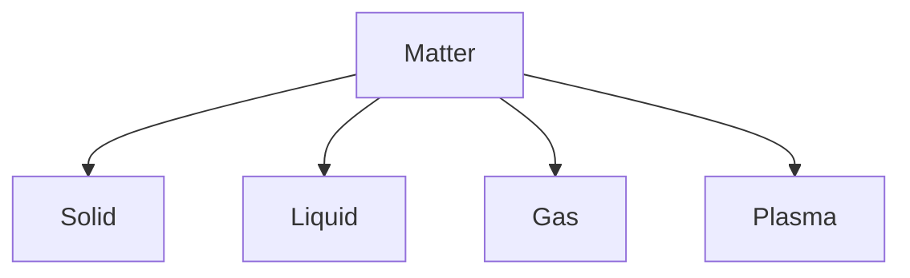
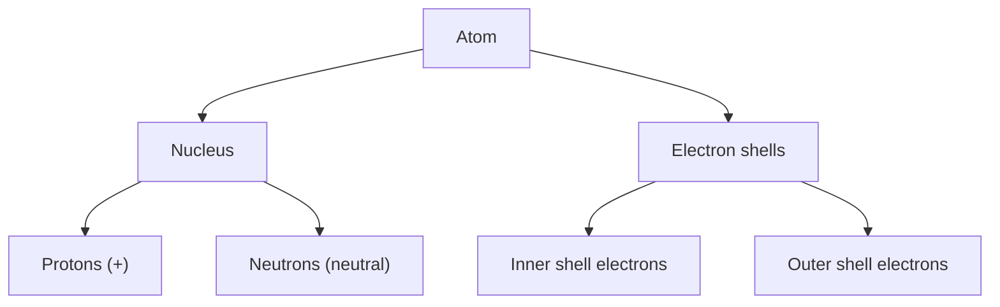
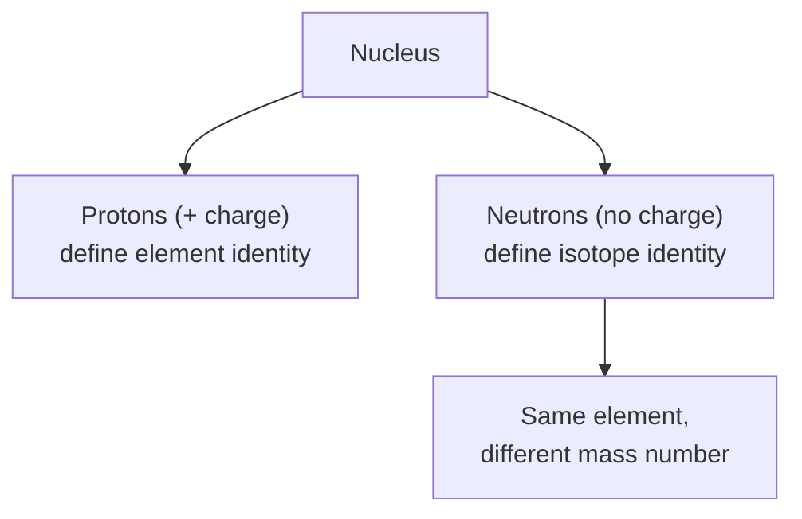
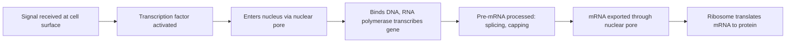
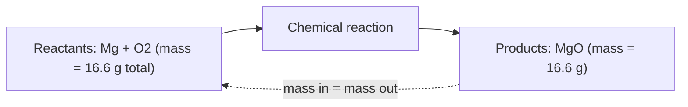

# SPL Run: build_concept_book

- **Adapter:** claude_cli
- **Model:** claude-sonnet-5
- **Tokens:** 22842 in / 13525 out
- **Latency:** 374761ms
- **Timestamp:** 2026-09-27 12:23:48

## Output

```output


---

## Element

An element is a substance made of only one type of atom, defined by the number of protons in its nucleus (its atomic number). This number cannot be changed by ordinary chemical reactions — carbon is carbon because it has 6 protons, and no amount of heating, mixing, or reacting will turn it into nitrogen (7 protons) or boron (5). There are 118 known elements, organized in the periodic table by increasing atomic number, and each is represented by a one- or two-letter symbol (O for oxygen, Na for sodium, Fe for iron). Elements are the basic chemical building blocks: everything you encounter — water, plastic, your own body — is made from combinations of a relatively small set of elements bonded together into compounds.

It's important to distinguish an element from a compound and from a mixture. Table salt (NaCl) is a compound because sodium and chlorine are chemically bonded in a fixed ratio and can only be separated by a chemical reaction. Air, by contrast, is a mixture of elements and compounds (nitrogen gas, oxygen gas, carbon dioxide, argon) that are simply mixed together, not chemically bonded, and can in principle be separated by physical means like distillation.

Consider a practical identification problem: you're given a shiny, malleable solid that conducts electricity and doesn't react with dilute acid. Is it an element? These physical properties — luster, malleability, conductivity — are hallmarks of metallic elements (like copper or gold), but they don't by themselves prove the sample is a pure element rather than an alloy (a mixture of metals, such as brass). A chemist would need to check whether the sample has a single, sharp melting point (pure substances do; mixtures typically melt over a range) or run a spectroscopic test, which detects the unique emission or absorption pattern of light that each element produces. If the spectrum shows only the signature lines of copper, for example, the sample is elemental copper; if it shows lines from both copper and zinc, it's an alloy. This illustrates a general problem-solving strategy in chemistry: physical properties narrow down what a substance might be, but composition — what atoms are actually present — is what determines whether something counts as a true element.

---

## Matter

Matter is anything that has mass and occupies space (volume). This definition is broader than it first appears: it includes solids, liquids, and gases, but also plasmas, and it excludes things like light, heat, and sound, which carry energy but have no mass and take up no space of their own. Everything you can touch, weigh, or contain is matter; everything you can only feel or perceive as a form of energy transfer is not.

The one property that varies most visibly across matter is its **state** — the physical arrangement of the particles that make it up. In a *solid*, particles are packed tightly in a fixed arrangement, so the sample holds its own shape and volume. In a *liquid*, particles stay close together but can slide past one another, so the sample takes the shape of its container while keeping a fixed volume. In a *gas*, particles are far apart and move independently, so the sample expands to fill whatever container it's in, with neither fixed shape nor fixed volume. A fourth state, *plasma*, occurs when a gas is given enough energy that electrons are stripped from its atoms — this is the state of matter inside stars and neon lights.

**Worked example.** You are given five items to sort: a wooden block, a puddle of water, the air inside a balloon, a beam of sunlight, and a cloud of steam. The block, water, air, and steam all have mass and occupy space, so all four are matter — solid, liquid, gas, and gas, respectively (steam is water vapor, a gas, not visible water droplets). Sunlight has no mass and occupies no space of its own; it is energy, not matter.

**Problem-solving application.** When you're unsure whether something is matter, apply a two-part test: *does it have mass, and does it take up a definite amount of space?* If yes to both, it's matter, and you can further ask what state it's in by checking whether it holds its own shape (solid), holds its own volume but not shape (liquid), or holds neither (gas). This same test explains everyday observations: a helium balloon still contains matter (the gas has mass and volume, just less dense than air), while the warmth you feel from a stove is not matter at all, even though it's real and measurable — it's a transfer of energy, not a substance you could scoop into a container.


*States of matter, distinguished by how tightly and freely their particles are arranged.*

---

## Dalton's Atomic Theory

In the early 1800s, John Dalton studied how elements combine to form compounds and noticed that they always react in fixed, whole-number mass ratios. To explain this, he proposed that matter is composed of atoms — indivisible particles that are the fundamental units of chemical change. Dalton's atomic theory rests on four key postulates: (1) all matter is made of tiny, indivisible atoms; (2) atoms of a given element are identical in mass and properties, while atoms of different elements differ; (3) compounds form when atoms of different elements combine in simple, fixed whole-number ratios; and (4) chemical reactions rearrange atoms but never create, destroy, or transform them into atoms of another element.

**Worked example.** Consider carbon monoxide (CO) and carbon dioxide (CO₂), both formed from carbon and oxygen. In CO, the mass ratio of oxygen to carbon is about 16:12, or 1.33:1. In CO₂, the ratio is about 32:12, or 2.66:1 — exactly twice the ratio found in CO. Dalton's theory explains this cleanly: since atoms combine in fixed whole-number ratios, a compound with twice as much oxygen per carbon atom must simply contain two oxygen atoms for every carbon atom, rather than some intermediate or fractional amount. Even though Dalton could not see atoms directly, the fact that the mass ratios always worked out to small whole numbers was strong evidence that matter is built from discrete, countable particles rather than continuously divisible stuff.

**Problem-solving application.** Suppose 3.0 g of element X combines with 4.0 g of element Y to form compound A, and 3.0 g of X combines with 8.0 g of Y to form compound B. To test whether A and B are consistent with Dalton's theory, compare the mass of Y that combines with the same fixed mass of X in each case: 8.0 g / 4.0 g = 2:1. Because this comes out to a ratio of small whole numbers, the data support Dalton's postulate that atoms combine in fixed, whole-number proportions — compound B simply contains twice as many Y atoms per X atom as compound A does.

Modern chemistry has revised some details of Dalton's original picture — atoms turn out to have internal structure, and not every atom of an element has exactly the same mass — but Dalton's central claim, that elements combine in fixed atomic ratios, remains the foundation of stoichiometry and quantitative chemistry today.

---

## Atom

An atom is the smallest unit of matter that retains the chemical identity of an element. Every atom consists of a dense central **nucleus**, containing positively charged protons and neutral neutrons, surrounded by negatively charged **electrons** occupying the surrounding space. The number of protons — the atomic number — defines which element the atom is; changing the proton count changes the element entirely. Neutrons contribute mass and stability but not charge, so atoms of the same element can have different neutron counts, called **isotopes**. In a neutral atom, the number of electrons equals the number of protons, balancing the charge.

Consider carbon, atomic number 6. A neutral carbon atom has 6 protons, 6 electrons, and — in its most common form — 6 neutrons, giving it a mass number of 12 (written carbon-12). Its electrons are arranged in two shells: 2 in the innermost shell and 4 in the outer shell, which holds up to 8. This half-filled outer shell is a direct consequence of carbon's electron count, and it foreshadows the atom's chemical behavior — a topic taken up in the next section on bonding.

The same logic — protons determine identity, electron arrangement follows from proton count — lets you work out the structure of any atom on the periodic table. Try it: oxygen has atomic number 8. A neutral oxygen atom therefore has 8 protons and 8 electrons. Filling shells in order (2 in the first shell, then the remaining 6 in the second) gives an outer shell of 6 electrons, two short of the stable 8. Nitrogen (atomic number 7) works out to 2 inner and 5 outer electrons. Given only an atomic number, you can now determine proton count, electron count, and shell arrangement for any element — the foundation you'll need before predicting how atoms combine.


*Structure of an atom: the nucleus holds protons and neutrons, while electrons occupy surrounding shells, filling the inner shell before the outer.*

---

## Electric Charge

Electric charge is a fundamental property of matter that causes particles to experience a force in the presence of other charged particles. Charge comes in two types, arbitrarily labeled positive and negative; like charges repel, and opposite charges attract. At the atomic level, protons carry a fixed positive charge, electrons carry an equal-magnitude negative charge, and neutrons carry no charge. The smallest observable unit of charge is the elementary charge, $e \approx 1.602 \times 10^{-19}$ coulombs (C), and any object's net charge is always an integer multiple of $e$ — a property called charge quantization. A rubbed balloon, a charged cell membrane, or an ion in solution can carry $\pm1e$, $\pm2e$, and so on, but never a fraction of $e$: charge always moves and accumulates in whole-electron steps.

**Worked example.** Suppose a plastic rod is rubbed with wool and gains a net charge of $-3.2 \times 10^{-9}$ C. How many excess electrons does it carry? Since each electron contributes $-e$, the number of excess electrons is
$$n = \frac{|q|}{e} = \frac{3.2 \times 10^{-9}\ \text{C}}{1.602 \times 10^{-19}\ \text{C}} \approx 2.0 \times 10^{10}\ \text{electrons.}$$
This illustrates charge quantization directly: the rod's charge isn't some arbitrary continuous value but a whole-number multiple of $e$, corresponding to a transfer of electrons from the wool to the rod.

**Problem-solving application.** Because charge is quantized, transfer problems reduce to counting electrons rather than reasoning about a continuous fluid. Suppose two identical plastic strips are rubbed together and afterward one strip is measured to carry $+1.6 \times 10^{-9}$ C. Quantization tells us this corresponds to exactly $n = q/e \approx 1.0 \times 10^{10}$ electrons missing from that strip — no more, no less. This kind of integer bookkeeping is the general strategy for any charge-transfer problem: given a measured charge, divide by $e$ to find the exact number of electrons gained or lost, and use that count — never a fractional value — to check whether a proposed charge is physically possible. The same reasoning applies wherever charge accumulates in discrete steps, from static electricity demonstrations to the buildup of charge across a biological membrane.

---

## Neutron

A neutron is a subatomic particle with no electric charge and a mass slightly greater than a proton's (about $1.675 \times 10^{-27}\ \text{kg}$, roughly 1 atomic mass unit). Neutrons reside in the atomic nucleus alongside protons, held together by the strong nuclear force, which overcomes the electrostatic repulsion between positively charged protons. Because neutrons carry no charge, they do not affect an atom's chemical identity — that is set entirely by the number of protons (atomic number, $Z$). Instead, the neutron count distinguishes isotopes: atoms of the same element that differ only in mass because they carry different numbers of neutrons.

Consider carbon, which always has 6 protons. Carbon-12 has 6 neutrons, while carbon-13 has 7 neutrons. Both isotopes behave identically in chemical reactions — the same electron configuration produces the same bonding patterns — because chemistry depends on protons and electrons, not neutrons. What differs is atomic mass and, in some cases, nuclear stability: certain neutron-to-proton combinations are unstable, and the nucleus will eventually decay, a process covered in more depth in the section on radioactive decay.

**Problem-solving application:** To find the number of neutrons in an atom, apply $N = A - Z$, where $A$ is the mass number (protons + neutrons) and $Z$ is the atomic number (protons). For example, an isotope of oxygen (Z = 8) with mass number 18 has $N = 18 - 8 = 10$ neutrons. This calculation is the standard first step in identifying an isotope from its symbol (e.g., $^{18}\text{O}$) and in balancing nuclear equations, where the total number of protons and neutrons must be conserved on both sides.


*The nucleus contains protons, which set the element, and neutrons, which determine which isotope of that element is present.*

Mastering the neutron count and the $N = A - Z$ relationship lays the groundwork for later topics — radioactive decay, half-life calculations, and isotopic techniques such as radiocarbon dating and medical imaging — where the neutron's role in nuclear stability becomes central.

---

## Proton

A proton is a subatomic particle carrying a single positive electric charge, with a mass of approximately $1.673 \times 10^{-27}$ kg (about 1,836 times the mass of an electron). Protons reside in the nucleus of every atom, bound tightly to neutrons by the strong nuclear force. The number of protons in an atom's nucleus — the atomic number, $Z$ — defines which element the atom is: every carbon atom has exactly 6 protons, every oxygen atom has exactly 8, and changing the proton count changes the identity of the element itself. Unlike protons, the number of neutrons or electrons an atom carries can vary without changing what element it is — but proton count alone is fixed and defining for a given element.

Worked example: Consider an atom with 17 protons in its nucleus. Its atomic number is $Z = 17$, which identifies it as chlorine — no other information is needed to make that identification, because proton count is the sole criterion the periodic table uses to order and name elements. If a second atom is found to have 20 protons, it is calcium, regardless of how many neutrons or electrons it happens to carry. Locating an element on the periodic table is, in effect, locating its proton count.

Problem-solving application: Whenever you are given a proton count, you can read the element identity directly off the periodic table by matching it to $Z$. Conversely, if you are told an atom is a particular element, you immediately know its proton count without further calculation — sulfur always has 16 protons, gold always has 79. This proton-based identification is the foundation for every subsequent topic in atomic structure: before reasoning about how atoms of the same element can differ, or how atoms gain and lose particles, you must first fix the proton count, because it is the one quantity that cannot change without transforming the atom into a different element altogether. Practice moving fluently in both directions — from proton count to element name, and from element name to proton count — since this bookkeeping step underlies nearly every calculation you will perform later in atomic and nuclear chemistry.

---

## Nucleus

The nucleus is the membrane-bound organelle in eukaryotic cells that houses the cell's genetic material (DNA) and directs nearly all cellular activity by controlling which genes are expressed. It is enclosed by the nuclear envelope, a double membrane perforated by nuclear pores that regulate traffic between the nucleus and cytoplasm. Inside, DNA is packaged with proteins called histones into chromatin, and a specialized region, the nucleolus, assembles ribosomal subunits. Because the nucleus separates transcription (making RNA from DNA) from translation (making protein from RNA), eukaryotic gene expression involves an extra layer of processing and control not found in bacteria, which lack a nucleus.

**Worked example.** Consider a liver cell responding to rising blood glucose. Insulin signaling activates transcription factors that pass through nuclear pores and bind promoter regions of genes encoding glycogen-synthesis enzymes. RNA polymerase transcribes these genes into pre-mRNA inside the nucleus; the pre-mRNA is spliced (introns removed) and capped before export through nuclear pores into the cytoplasm, where ribosomes translate it into functional enzyme. Note the sequence: signal → nucleus → transcription → processing → export → translation. Each step is a checkpoint where the cell can amplify, delay, or shut down the response.

**Problem-solving application.** Suppose a mutation disrupts a nuclear pore protein so that transcription factors cannot enter the nucleus efficiently. Predict the effect on gene expression and justify it using the transport pathway above. Since transcription factors must reach nuclear DNA to activate RNA polymerase, blocked nuclear entry would reduce transcription of target genes, even if the upstream signaling (e.g., insulin binding its receptor) functions normally. This reasoning — tracing where in the pathway a block occurs and predicting downstream consequences — is the core diagnostic skill used in interpreting real diseases, such as certain laminopathies (nuclear envelope disorders) where structural nuclear defects impair transcription factor access and cause tissue-specific dysfunction.


*Diagram showing how the nucleus compartmentalizes transcription and processing, separating them from cytoplasmic translation.*

This compartmentalization is the defining structural feature distinguishing eukaryotic gene regulation from the simpler, single-compartment system of prokaryotes.

---

## Atomic Number

The atomic number, symbolized $Z$, is the number of protons in the nucleus of an atom. It is the single property that defines what element an atom is: every carbon atom, anywhere in the universe, has exactly six protons ($Z = 6$), and any atom with seven protons is nitrogen, not carbon. Changing the number of protons changes the element itself, whereas changing the number of neutrons only creates a different isotope of the same element. On the periodic table, elements are arranged in order of increasing atomic number, which is why the table has a definite, non-arbitrary sequence rather than an alphabetical or historical one.

It is easy to confuse atomic number with mass number ($A$), which counts protons plus neutrons together. The two are related by $A = Z + N$, where $N$ is the neutron count, but they answer different questions: $Z$ tells you the identity of the element, while $A$ tells you the mass of a particular atom of that element. In a neutral atom, the atomic number also equals the number of electrons, since the negative charges must balance the positive charges of the protons. This is why $Z$ ultimately governs an element's chemical behavior — the arrangement of electrons, which drives bonding and reactivity, is dictated directly by how many electrons a neutral atom must hold.

**Worked example.** A sodium atom has 11 protons, 12 neutrons, and 11 electrons. Its atomic number is $Z = 11$, confirming it is sodium (element 11 on the periodic table). Its mass number is $A = 11 + 12 = 23$, giving the isotope sodium-23. If this atom loses one electron to form Na⁺, the atomic number stays $Z = 11$ — it is still sodium — but the electron count drops to 10, producing a net $+1$ charge.

**Problem-solving application.** Suppose an unknown atom has 26 protons and 30 neutrons. Its atomic number is $Z = 26$, which identifies it as iron regardless of neutron count. If a different sample of the "same" atom has 28 neutrons instead, it is still iron ($Z = 26$) but a different isotope, with mass number $A = 54$ instead of $58$. This distinction is the basis for identifying elements from nuclear data: atomic number fixes identity, while mass number and neutron count distinguish isotopes of that same element — a distinction essential in fields from radiometric dating to nuclear medicine.

---

## Mass

Mass is the measure of the amount of matter in an object, expressed in kilograms (kg) or grams (g) in the SI system. It is a fundamental property distinct from weight: mass stays constant regardless of location, while weight (a force) depends on the local strength of gravity. An astronaut's mass is the same on Earth and on the Moon, even though their weight — and the sensation of being pulled downward — differs dramatically between the two.

Mass determines how strongly an object resists a change in motion, a property called inertia. This connects directly to Newton's second law, $F = ma$, where a given force produces a smaller acceleration in a more massive object. Mass also governs gravitational attraction: two objects pull on each other with a force proportional to the product of their masses, as described by Newton's law of universal gravitation, $F = G\frac{m_1 m_2}{r^2}$.

**Worked example.** A chemistry student places 25.0 g of solid copper(II) sulfate in a beaker and dissolves it completely in water. After the water evaporates, the solid copper(II) sulfate crystals that remain have a mass of 25.0 g — unchanged, because dissolving and evaporating are physical changes that neither create nor destroy matter. This illustrates the law of conservation of mass: in any physical or chemical process occurring in a closed system, total mass before and after remains constant.

**Problem-solving application.** Conservation of mass is the backbone of stoichiometry. Suppose 10.0 g of magnesium reacts completely with oxygen to form magnesium oxide (MgO) according to $2\text{Mg} + \text{O}_2 \rightarrow 2\text{MgO}$. If the reaction produces 16.6 g of MgO, the mass of oxygen consumed must be $16.6\text{ g} - 10.0\text{ g} = 6.6\text{ g}$, since the total mass of reactants must equal the total mass of products. This mass-balance reasoning lets chemists calculate unknown quantities — yields, reactant amounts, or leftover material — in reactions ranging from simple combustion to industrial synthesis, without needing to directly measure every substance involved.



*Diagram showing conservation of mass: the total mass of reactants equals the total mass of products in a chemical reaction.*

---

## Atomic Mass Unit

The atomic mass unit (u), also called the dalton (Da), is the standard unit for expressing the mass of atoms and molecules. Because atoms are far too small to weigh in grams (a single hydrogen atom has a mass of about $1.67 \times 10^{-24}$ g), chemists use a relative scale instead. By international agreement, one atomic mass unit is defined as exactly $\frac{1}{12}$ the mass of a single carbon-12 atom, the most common isotope of carbon. This gives 1 u $= 1.6605 \times 10^{-24}$ g. Carbon-12 was chosen as the reference because it is stable, abundant, and easy to isolate in pure form, making it a reliable universal benchmark.

Every element's atomic mass, listed on the periodic table, is measured in atomic mass units. Hydrogen has an atomic mass of about 1.008 u, oxygen about 16.00 u, and iron about 55.85 u. These values represent the weighted average mass of all naturally occurring isotopes of that element, accounting for how abundant each isotope is. For example, chlorine has two major isotopes, chlorine-35 and chlorine-37, occurring in roughly a 3:1 ratio. The weighted average, $(0.758 \times 35) + (0.242 \times 37) \approx 35.45$ u, is the value printed on the periodic table for chlorine.

This system solves a practical problem: it lets chemists compare atoms and molecules on a common, convenient numerical scale without writing out extremely small numbers in grams every time. When you calculate the molar mass of a compound, such as water ($\mathrm{H_2O}$), you simply add the atomic masses: $2(1.008) + 16.00 = 18.02$ u. This same number, expressed in grams per mole, tells you the mass of one mole ($6.022 \times 10^{23}$ molecules) of water — a direct bridge between atomic-scale mass and lab-scale measurements you can weigh on a balance.

Try this: calculate the atomic mass unit value for a molecule of carbon dioxide ($\mathrm{CO_2}$), using carbon at 12.01 u and oxygen at 16.00 u per atom. Adding one carbon and two oxygens gives $12.01 + 2(16.00) = 44.01$ u — the same number used to determine that 44.01 grams of $\mathrm{CO_2}$ constitutes one mole, a calculation performed routinely in stoichiometry problems throughout general chemistry.

---

## Electron

An electron is a subatomic particle carrying a single negative elementary charge ($-1.602 \times 10^{-19}$ C) and a mass of about $9.109 \times 10^{-31}$ kg — roughly 1/1836 the mass of a proton. Electrons occupy the space surrounding an atom's nucleus, organized into energy levels (shells) and sublevels (orbitals) rather than fixed orbits. Because electrons are so much lighter than protons or neutrons, their behavior — not nuclear mass — governs nearly all of chemistry: bonding, reactivity, electrical conductivity, and light absorption all trace back to how electrons are arranged and how easily they move.

Each neutral atom has a number of electrons equal to its atomic number (number of protons). These electrons fill orbitals in order of increasing energy, following the Aufbau principle, the Pauli exclusion principle (each orbital holds at most two electrons, with opposite spins), and Hund's rule (electrons fill empty orbitals singly before pairing). The outermost electrons, called valence electrons, determine an element's chemical behavior. Sodium (atomic number 11) has the configuration $1s^2 2s^2 2p^6 3s^1$ — one lone valence electron that it readily loses to form Na⁺, achieving a stable, filled-shell configuration matching neon.

Consider predicting the charge an atom will adopt when it forms an ion. Chlorine has 17 electrons: $1s^2 2s^2 2p^6 3s^2 3p^5$. Its outer shell is one electron short of the stable eight-electron (octet) configuration, so chlorine tends to gain one electron, becoming Cl⁻. When sodium and chlorine react, sodium transfers its single valence electron to chlorine, and the resulting Na⁺ and Cl⁻ ions attract each other electrostatically to form the ionic solid NaCl. This electron-transfer logic — atoms losing or gaining electrons to reach a stable octet — lets you predict the formula and charge of many ionic compounds without memorization: magnesium (2 valence electrons) plus oxygen (needs 2 electrons) gives MgO; aluminum (3 valence electrons) plus oxygen gives Al₂O₃, balancing the three electrons aluminum loses against the two oxygen needs, requiring two aluminum atoms for every three oxygen atoms.

Electrons are also responsible for electric current (a flow of electrons through a conductor) and for the specific colors atoms emit or absorb, since electrons release energy as light when they drop from a higher energy level to a lower one.

---

## Isotope

An isotope is one of two or more forms of the same chemical element whose atoms have the same number of protons but different numbers of neutrons. Because the number of protons (the atomic number, $Z$) defines what element an atom is, isotopes of an element share the same chemical behavior — they occupy the same position on the periodic table and form the same types of bonds. What differs is mass: extra neutrons add to the mass number ($A = Z + N$, where $N$ is the number of neutrons), making some isotopes heavier than others. Isotopes are named by their mass number, as in carbon-12 or carbon-14.

**Worked example.** Carbon has three naturally occurring isotopes: carbon-12 ($^{12}\text{C}$, 6 protons + 6 neutrons), carbon-13 ($^{13}\text{C}$, 6 protons + 7 neutrons), and carbon-14 ($^{14}\text{C}$, 6 protons + 8 neutrons). All three have 6 protons and 6 electrons, so all behave identically in chemical reactions — they form the same bonds and molecules. But $^{12}\text{C}$ and $^{13}\text{C}$ are stable, while $^{14}\text{C}$ is radioactive: its nucleus is unstable and decays over time, emitting radiation as it converts a neutron into a proton. This decay happens at a fixed, measurable rate.

**Problem-solving application.** Because radioactive isotopes decay at a constant, known rate — described by their half-life, the time required for half of a sample to decay — scientists use them as clocks. Carbon-14 has a half-life of about 5,730 years. A living organism continuously exchanges carbon with its environment, keeping its $^{14}\text{C}$ ratio constant, but once it dies, that exchange stops and the $^{14}\text{C}$ it contains steadily decays while the stable $^{12}\text{C}$ does not. By measuring how much $^{14}\text{C}$ remains relative to $^{12}\text{C}$ in a fossil or artifact, and comparing it to the ratio in living organisms, researchers can calculate how many half-lives have elapsed and thus estimate the sample's age. This technique, radiocarbon dating, is reliable for organic material up to roughly 50,000 years old — beyond that, too little $^{14}\text{C}$ remains to measure accurately, and other isotopes (such as uranium-lead, with a much longer half-life) are used instead for dating older geological samples.

---

## Average Atomic Mass

The atomic mass listed on the periodic table for any element is not the mass of a single atom — it is a **weighted average** of the masses of all naturally occurring isotopes of that element, weighted by how abundant each isotope is in nature. Isotopes of an element have the same number of protons but different numbers of neutrons, so they differ slightly in mass. Because a natural sample of an element is a mixture of these isotopes in fixed proportions, chemists report a single average value that reflects what you would actually weigh out in the lab.

The calculation is straightforward: multiply each isotope's mass by its fractional abundance (as a decimal), then sum the results.

$$
\text{Average atomic mass} = \sum_i (\text{mass of isotope}_i \times \text{fractional abundance}_i)
$$

**Worked example.** Chlorine occurs naturally as two isotopes: chlorine-35 (mass = 34.969 amu, abundance = 75.77%) and chlorine-37 (mass = 36.966 amu, abundance = 24.23%). Applying the formula:

$$
(34.969)(0.7577) + (36.966)(0.2423) = 26.496 + 8.960 = 35.456 \text{ amu}
$$

This matches the periodic table value of 35.45 amu for chlorine — and explains why it isn't a whole number, unlike the mass of any individual atom.

**Problem-solving application.** This calculation is reversible: if you know the average atomic mass and the masses of two isotopes, you can solve for the unknown abundances. Suppose copper has two isotopes, Cu-63 (62.930 amu) and Cu-65 (64.928 amu), and its average atomic mass is 63.546 amu. Let $x$ be the fractional abundance of Cu-63, so $(1-x)$ is the abundance of Cu-65:

$$
62.930x + 64.928(1-x) = 63.546
$$

Solving gives $x \approx 0.692$, meaning copper is about 69.2% Cu-63 and 30.8% Cu-65 — consistent with measured values. This algebraic reversal is a common exam question and also underlies how mass spectrometry data (which gives isotope masses and relative peak heights) is converted into the atomic mass reported on the periodic table.

---

## Ion

An ion is an atom or molecule that has gained or lost one or more electrons, giving it a net electric charge. Atoms are normally neutral because the number of protons (positive) equals the number of electrons (negative). When an atom loses electrons, protons outnumber electrons and the atom becomes a positively charged **cation**. When an atom gains electrons, electrons outnumber protons and the atom becomes a negatively charged **anion**. Ions form because atoms "prefer" to have a full outer electron shell (a stable octet, for most main-group elements), and losing or gaining a small number of electrons is often the easiest path to that stability.

**Worked example:** Sodium (Na) has 11 electrons, configured as 2, 8, 1 — one lone electron in its outer shell. Losing that electron is energetically favorable, leaving Na with 11 protons but only 10 electrons: a net charge of $+1$, written $\text{Na}^+$. Chlorine (Cl) has 17 electrons, configured as 2, 8, 7 — one electron short of a full shell. Gaining an electron gives it 17 protons and 18 electrons: a net charge of $-1$, written $\text{Cl}^-$. When sodium transfers its extra electron to chlorine, both atoms achieve stable octets, and the resulting $\text{Na}^+$ and $\text{Cl}^-$ ions attract each other electrostatically to form the ionic compound NaCl (table salt).

**Problem-solving application:** To predict the charge an element's ion will carry, look at its position on the periodic table. Group 1 metals (Li, Na, K) lose one electron to form $+1$ cations; Group 2 metals (Mg, Ca) lose two electrons to form $+2$ cations; Group 17 halogens (F, Cl, Br) gain one electron to form $-1$ anions; Group 16 elements (O, S) gain two electrons to form $-2$ anions. This pattern lets you predict formulas for ionic compounds: since charges must balance to zero overall, calcium ($\text{Ca}^{2+}$) and chloride ($\text{Cl}^-$) combine in a 1:2 ratio to form $\text{CaCl}_2$, not CaCl. This charge-balancing logic is also essential in biology and chemistry labs — for example, predicting how ions like $\text{Na}^+$, $\text{K}^+$, and $\text{Cl}^-$ distribute across a cell membrane to generate electrical signals in neurons, or calculating the correct ratios of ions needed to prepare a buffer solution.

---

## Mass Spectrometry

Mass spectrometry is an analytical technique that identifies the atoms and molecules in a sample by measuring their mass-to-charge ratio ($m/z$). A mass spectrometer converts sample particles into gas-phase ions, accelerates them through an electric field, and deflects their paths using a magnetic field. Because lighter ions and more highly charged ions deflect more sharply, particles with different $m/z$ values separate and strike a detector at different positions. The output is a mass spectrum: a plot of relative abundance (intensity) versus $m/z$, in which each peak corresponds to a distinct ion.

The process has three core stages. First, ionization strips or adds electrons to sample particles, most commonly by bombarding them with a high-energy electron beam, which knocks off an electron to form a positive ion. This ionization step often fragments the original molecule into smaller charged pieces, and the resulting fragmentation pattern is itself diagnostic — it acts like a molecular fingerprint. Second, acceleration and deflection sort ions by $m/z$ using electric and magnetic fields. Third, detection records the abundance of each ion arriving at a given $m/z$.

Consider a sample of neon gas analyzed by mass spectrometry. The spectrum shows two peaks: one at $m/z = 20$ with high intensity and one at $m/z = 22$ with much lower intensity. These correspond to the isotopes neon-20 and neon-22. Because relative peak height reflects relative abundance, chemists calculate the element's average atomic mass from the spectrum. If neon-20 makes up 90.5% of atoms and neon-22 makes up 9.5%, the weighted average is:

$$
(0.905)(20) + (0.095)(22) = 20.19 \text{ amu}
$$

This calculation is precisely how the atomic masses listed on the periodic table are determined — they are weighted averages of naturally occurring isotopes, not the mass of any single atom.

In problem-solving contexts, mass spectrometry data lets you back-calculate isotopic abundances, identify unknown compounds from their fragmentation patterns, or determine a molecule's molar mass from its highest-$m/z$ peak (the molecular ion peak, assuming a charge of +1). Given a spectrum with two isotope peaks and their relative intensities, you can set up a weighted-average equation, as above, and solve for either the abundances or the average atomic mass, whichever is unknown. This makes mass spectrometry a practical bridge between raw instrumental data and quantitative atomic theory.

---

## Payoff

Every concept in this book has been building toward a single practical question: given an unknown substance, how do you determine exactly what it is made of? Mass spectrometry is the answer, and it earns its place as the capstone because it converts a purely physical measurement — the mass of a charged particle — into chemical identity. The instrument ionizes a sample, accelerates the resulting ions through electric and magnetic fields, and sorts them by their mass-to-charge ratio, $m/z$. Lighter ions and more highly charged ions curve more sharply in a magnetic field; heavier, singly charged ions curve less. By recording where each ion lands, the spectrometer produces a spectrum of peaks, each corresponding to a specific $m/z$ value and each peak's height reflecting how abundant that ion is in the sample. From this single measurement, a chemist can read off molecular weight, isotope ratios, and — when the molecule fragments predictably during ionization — the arrangement of atoms within it.

This is why mass spectrometry sits downstream of nearly everything else you have studied. Atomic structure and isotopes explain why an element gives more than one peak (carbon-12 versus carbon-13). Molecular formulas and bonding explain why a compound fragments the way it does, and stoichiometry lets you convert peak patterns into a confirmed molecular formula. Equilibrium and reaction mechanisms are tested directly when a mass spectrometer is coupled to a gas or liquid chromatograph, identifying reaction intermediates as they form. In environmental and forensic chemistry, the same technique detects trace contaminants or drugs at parts-per-billion concentrations, because the instrument doesn't just weigh a sample — it counts individual ions.

Consider a forensic toxicologist analyzing a blood sample for an unknown drug. GC-MS separates the components, and the mass spectrum of each one is compared against a reference library, giving both identification and, from peak intensity, quantification. The same workflow — ionize, separate by $m/z$, match the fragmentation pattern — underlies drug testing, protein sequencing in proteomics, and even the search for organic molecules on Mars.

Where would you like to go next: environmental trace analysis, pharmaceutical drug screening, or protein identification in proteomics?
```
