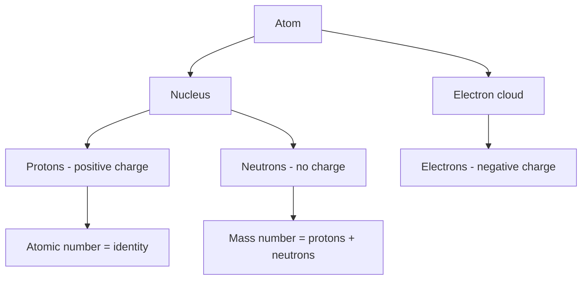
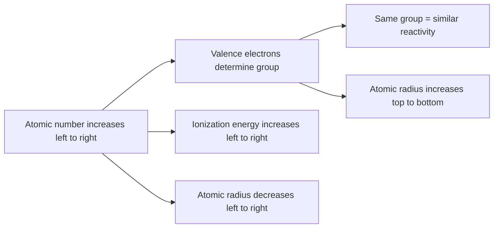

# SPL Run: build_concept_book

- **Adapter:** claude_cli
- **Model:** claude-sonnet-5
- **Tokens:** 21745 in / 13386 out
- **Latency:** 377627ms
- **Timestamp:** 2026-09-27 12:30:04

## Output

```output


---

## Element

An element is a pure substance that cannot be broken down into simpler substances by ordinary chemical means, because all of its atoms share the same number of protons (its atomic number). This proton count defines the element's identity: any atom with 6 protons is carbon, any atom with 79 protons is gold, regardless of how many neutrons or electrons it has. There are 118 known elements, of which about 94 occur naturally on Earth; the rest are synthesized in laboratories. Elements are the fundamental "building blocks" from which all compounds are formed, in the same sense that letters combine to form words.

Each element is represented by a one- or two-letter symbol (H for hydrogen, Na for sodium, Fe for iron — often derived from Latin names) and organized in the periodic table by increasing atomic number. Position in the table is not arbitrary: elements in the same column (group) share similar numbers of valence electrons and therefore similar chemical behavior. For example, all group 1 elements (Li, Na, K...) have one valence electron and react vigorously with water to form a hydroxide and hydrogen gas.

**Worked example**: Consider sodium (Na, atomic number 11) and chlorine (Cl, atomic number 17). Sodium has 11 protons and 1 valence electron; chlorine has 17 protons and 7 valence electrons, needing just 1 more to complete its outer shell. When they react, sodium transfers its lone valence electron to chlorine, producing Na⁺ and Cl⁻ ions that attract each other to form the compound sodium chloride (NaCl) — table salt. Neither sodium metal nor chlorine gas alone resembles table salt at all; the compound's properties emerge only from the combination.

**Problem-solving application**: Given an atomic number, you can predict reactivity by counting valence electrons. Suppose you're told an unknown element has atomic number 12. Using the periodic table, atomic number 12 is magnesium, located in group 2, meaning it has 2 valence electrons. You can predict it will lose both electrons to form a 2+ ion (Mg²⁺) and will react with elements needing 2 electrons, such as oxygen (O²⁻), to form MgO in a 1:1 ratio. This predictive power — using position on the periodic table to forecast bonding behavior — is the practical payoff of understanding what an element is and how its atomic structure determines its chemistry.

---

## Matter

Matter is anything that has mass and occupies space (volume). This definition sounds simple, but it is the foundation of chemistry: every substance you can touch, weigh, or contain — air, water, rock, your own body — qualifies as matter, while things like light, heat, or sound do not, because they carry energy without mass or a fixed volume. (Chemistry offers several ways to further classify matter — by composition or by physical state — and those classifications are the subject of later sections; here the goal is simply to be able to recognize matter using its two defining properties.)

**Worked example**: Suppose you are asked to decide, for each item in a list, whether it counts as matter. A puddle of water: yes — it has mass (you could weigh it) and occupies a measurable volume. A beam of sunlight: no — it carries energy and can even exert a tiny pressure, but it has no mass and no fixed volume; remove the light source and nothing remains to weigh. A cloud of steam: yes, even though it seems to vanish as it disperses — the water vapor molecules still have mass and still occupy space, just spread out more than in liquid water. A sound wave traveling through air: no — the sound is a disturbance of pressure moving through the air molecules (which are matter), but the wave itself is not a substance with mass. In each case, the test is the same: can you, in principle, weigh it and measure how much space it takes up?

**Problem-solving application**: This definition resolves questions that intuition alone gets wrong. Imagine a sealed, rigid metal box is weighed empty, then weighed again after being filled with a gas (not evacuated). Someone who thinks of gas as "basically nothing" predicts the two readings will be identical. Applying the definition of matter correctly predicts otherwise: because the gas has mass — however small compared to the box — the filled box must weigh more, even though the gas is invisible and takes the shape of its container rather than having a shape of its own. The same reasoning explains why a helium balloon still has mass, and would register on a sufficiently sensitive scale, even though it floats: buoyancy changes apparent weight in air, not whether the material inside is matter. Learning to distinguish "has mass and volume" from "is visible" or "feels heavy" is the core skill this definition builds, and it is the skill you will keep applying as later sections introduce finer distinctions among the many kinds of matter.

---

## Daltons Atomic Theory

In the early 1800s, English chemist John Dalton synthesized decades of experimental observation into the first modern atomic theory. His model rested on four core claims: (1) all matter is composed of tiny, indivisible particles called atoms; (2) atoms of a given element are identical in mass and properties, while atoms of different elements differ; (3) atoms cannot be created, destroyed, or converted into atoms of another element during a chemical reaction; and (4) compounds form when atoms of different elements combine in small, whole-number ratios. Dalton did not derive this from a single controlled experiment — he built it to explain observations chemists had already established: reactions never gain or lose mass, and a given compound always contains its elements in the same fixed mass ratio, regardless of source or how it was made.

Consider water as a worked example. Chemists had already measured that water is always 11.19% hydrogen and 88.81% oxygen by mass, no matter where the sample came from. Dalton's theory explained this rigidly fixed ratio: if water is always built from the same number of hydrogen atoms combined with the same number of oxygen atoms, and each atom has a fixed mass, then the overall mass ratio must always come out the same. This reasoning let Dalton propose relative atomic weights — assigning hydrogen a value near 1 and calculating other elements' masses from the mass ratios measured in known compounds.

For problem-solving, Dalton's theory gives a direct way to check whether two compounds are made of the same elements combined differently. Carbon and oxygen illustrate this: in carbon monoxide, 12 g of carbon combines with 16 g of oxygen; in carbon dioxide, 12 g of carbon combines with 32 g of oxygen. Holding the carbon mass fixed, the oxygen masses simplify to a 1:2 ratio — exactly what Dalton's theory predicts if CO and CO2 differ by one whole oxygen atom per carbon atom. A student can apply this same reasoning to unfamiliar mass-composition data: if two compounds share two elements, comparing the mass of one element per fixed mass of the other should reduce to a small whole-number ratio, confirming that atoms are combining in discrete, countable units rather than continuously.

Later discoveries — subatomic particles, isotopes, and nuclear reactions — revised parts of Dalton's theory, but his core insight that matter is quantized into countable atomic units remains the foundation of chemistry.

---

## Atom

An atom is the smallest unit of an element that retains the chemical properties of that element. Every atom consists of a dense central nucleus, containing positively charged protons and electrically neutral neutrons, surrounded by a cloud of negatively charged electrons occupying most of the atom's volume. The number of protons — the atomic number — defines which element the atom is; changing the number of neutrons produces isotopes of the same element, while changing the number of electrons produces ions with a net charge. Protons and neutrons each have a mass of approximately 1 atomic mass unit (amu), while electrons are roughly 1,836 times lighter, meaning nearly all of an atom's mass resides in its nucleus even though the nucleus occupies only about 1/10,000th of the atom's diameter.

Consider carbon-12, the reference isotope for the atomic mass unit itself. It has 6 protons (atomic number 6), 6 neutrons, and 6 electrons, giving it a mass number of 12. Compare this to carbon-14, which has 6 protons and 6 electrons (still carbon, chemically) but 8 neutrons, making it a heavier, radioactive isotope used in radiocarbon dating. This comparison illustrates a key distinction: atomic number determines identity, while mass number (protons + neutrons) determines isotope.

This structural model lets you solve practical composition problems. Given an atom's mass number and atomic number, you can calculate neutrons directly: number of neutrons = mass number − atomic number. For example, an atom of sodium-23 (atomic number 11) has 23 − 11 = 12 neutrons. If the same atom carries a charge, electron count shifts while proton count stays fixed: a sodium ion with a +1 charge (Na⁺) still has 11 protons but only 10 electrons, since it has lost one electron. Working through such problems — starting from the periodic table's atomic number, then adjusting for isotope mass and ionic charge — is the standard method chemists use to fully characterize any atom or ion before predicting its chemical behavior.


*Structure of an atom, showing how protons, neutrons, and electrons determine elemental identity and isotope mass.*

---

## Electric Charge

Electric charge is a fundamental property of matter that determines how a particle interacts with other charged particles. Charge comes in two types, arbitrarily labeled positive and negative. Protons carry a positive charge, electrons carry a negative charge of equal magnitude, and neutrons carry no charge. Like charges repel one another, and opposite charges attract.

Charge has two defining properties. First, it is quantized: it always occurs in whole-number multiples of the elementary charge, $e = 1.602 \times 10^{-19}$ coulombs (C). Any observable charge $q$ must satisfy $q = ne$, where $n$ is an integer — you cannot have half an elementary charge. Second, charge is conserved: in any isolated system, the total charge before an interaction equals the total charge after it, whether the interaction is a chemical reaction, a lightning strike, or a nuclear decay. Charge is never created or destroyed, only transferred or rearranged.

**Worked example**: A balloon rubbed against hair loses $2.0 \times 10^{13}$ electrons through friction. The resulting charge on the balloon is found using the quantization rule:
$$q = ne = (2.0 \times 10^{13})(1.602 \times 10^{-19}\ \text{C}) \approx 3.2 \times 10^{-6}\ \text{C}$$
Because electrons were removed, the balloon is left positively charged, and the hair — which gained those electrons — carries an equal negative charge. The total charge of the balloon-hair system is unchanged; charge was simply redistributed.

**Problem-solving application**: Charge conservation lets you solve for an unknown charge in a reaction, provided you know the charges of every other participant. Consider a radioactive decay in which a neutron (charge 0) converts into a proton (charge $+e$) and an electron (charge $-e$):
$$0 = (+e) + (-e) + q_{\text{unknown}}$$
Solving gives $q_{\text{unknown}} = 0$, which is exactly why this decay must also produce a neutral particle (the antineutrino) to balance the books. This same conservation bookkeeping applies whenever atoms lose or gain electrons during ionization, combustion, or electrolysis: add up the charges you know, and conservation tells you what charge must remain on whatever you don't.

---

## Neutron

A neutron is one of the two types of nucleons—particles that occupy the nucleus of an atom, alongside protons. It carries no electric charge (hence "neutron") and has a mass of approximately $1.675 \times 10^{-27}\text{ kg}$, about 0.1% greater than the mass of a proton. Because neutrons have mass but no charge, they contribute to an atom's total mass without affecting its charge or its chemical behavior, which is governed by the number of protons and electrons. The number of neutrons in a nucleus can vary independently of the element's identity: atoms of the same element can carry different numbers of neutrons, and therefore different masses, while remaining chemically identical—the isotopes you may already know from general chemistry.

**Worked example.** Consider carbon, which always has 6 protons. The most abundant form, carbon-12, carries 6 neutrons, while carbon-14, used in radiocarbon dating, carries 8. Both are chemically identical—both form the same bonds and behave the same way in reactions—but carbon-14 is unstable and undergoes radioactive decay, while carbon-12 is stable. This illustrates the key role neutrons play: they add nuclear mass and influence nuclear stability, without altering chemical identity.

**Problem-solving application.** A common exercise is finding how many neutrons an atom has, given its total nucleon count and its number of protons (found from the periodic table). Simply subtract: neutrons = total nucleons − protons. For example, uranium-238 has 92 protons, so it carries $238 - 92 = 146$ neutrons. This kind of accounting is essential in nuclear chemistry for identifying isotopes and for balancing nuclear equations, where the total number of nucleons must be conserved on both sides of a reaction. Neutrons also matter practically outside the classroom: in nuclear fission, a neutron striking a uranium-235 nucleus destabilizes it, causing it to split and release more neutrons of its own—a chain reaction that underlies both nuclear power generation and nuclear weapons.

---

## Proton

A proton is a positively charged subatomic particle found in the nucleus of every atom, with a charge of $+1$ elementary charge and a mass of approximately $1.67 \times 10^{-27}$ kg (about 1 atomic mass unit). The number of protons in an atom's nucleus, called the atomic number ($Z$), defines which chemical element the atom is — this number never changes without transforming the atom into a different element. Protons, along with neutrons, make up the nucleus, while electrons occupy the surrounding space and balance the positive charge in a neutral atom.

Consider carbon: every carbon atom has exactly 6 protons. This is what makes it carbon, whether it appears in diamond, graphite, or carbon dioxide. If a carbon nucleus somehow gained a seventh proton, it would instantly become nitrogen — a different element with entirely different chemical behavior. This is why the periodic table is organized by atomic number: it is fundamentally a proton count, not a mass listing. Contrast this with neutrons, which can vary in number within the same element, producing isotopes (like carbon-12 and carbon-14) without changing the element's chemical identity.

Understanding protons lets you solve identity and charge problems directly. Given an ion like $\text{Mg}^{2+}$, you know magnesium has $Z = 12$, so the ion still contains 12 protons — the $2+$ charge arises because it has only 10 electrons, not because the nucleus changed. Similarly, when balancing nuclear equations (as in radioactive decay), the total number of protons (and the total mass number) must be conserved on both sides. For example, in alpha decay, a nucleus emits a helium nucleus (2 protons, 2 neutrons), so the atomic number of the resulting nucleus decreases by exactly 2 — allowing you to predict the identity of the daughter element without memorizing decay chains.

<figure class="cb-figure">
  
  <figcaption>A stylized atomic model showing protons and neutrons clustered in the nucleus, with electrons in surrounding orbits. Source: <a href="https://commons.wikimedia.org/wiki/File:Stylised_atom_with_three_Bohr_model_orbits_and_stylised_nucleus.svg">Wikimedia Commons</a>, Public Domain.</figcaption>
</figure>

Because proton number is fixed and defines elemental identity, it serves as the anchor for nearly all quantitative reasoning in chemistry — from writing electron configurations to predicting reactivity trends across the periodic table.

---

## Nucleus

The nucleus is the membrane-bound organelle in eukaryotic cells that houses the cell's genetic material — its DNA — and serves as the control center for growth, metabolism, and reproduction. Enclosed by a double-membraned nuclear envelope studded with nuclear pores, the nucleus regulates which molecules move between itself and the cytoplasm. Inside, DNA is organized with proteins into chromatin, and a dense region called the nucleolus assembles ribosomal subunits. The nucleus is what distinguishes eukaryotic cells (plants, animals, fungi, protists) from prokaryotic cells (bacteria, archaea), whose DNA floats freely in the cytoplasm in a region called the nucleoid.

**Worked example**

Consider a liver cell exposed to a toxin that damages proteins in the cytoplasm. The cell needs to produce more detoxifying enzymes. The process runs through the nucleus in sequence: (1) a signal reaches the nucleus, and regulatory proteins pass through nuclear pores to bind specific genes; (2) RNA polymerase transcribes those genes into messenger RNA (mRNA) inside the nucleus; (3) the mRNA is processed and exported through nuclear pores into the cytoplasm; (4) ribosomes translate the mRNA into new enzyme proteins. Every instruction for building a protein originates in the nucleus, but the actual protein synthesis happens outside it — a division of labor that lets the cell protect its master genetic copy while still responding quickly to changing conditions.

**Problem-solving application**

Suppose you are given two unlabeled cell samples under a microscope: one from an onion root tip, one from a bacterial culture. You see no visible nucleus in either using a basic stain, but you have access to a fluorescent DNA-binding dye. Reasoning through nuclear structure tells you what to expect: in the eukaryotic (onion) sample, the dye should concentrate in a single, well-defined, roughly spherical region enclosed by a membrane — the DNA is confined there because the nuclear envelope keeps it separated from the cytoplasm. In the bacterial sample, the dye should instead appear as a diffuse or irregularly shaped patch with no membrane boundary, since prokaryotic DNA is not enclosed. This distinction — a bounded nucleus versus a boundary-less nucleoid — is a standard diagnostic used in cell biology to classify unknown cell types, and it directly follows from the defining structural feature of the nucleus: compartmentalization by a selectively permeable envelope.

<figure class="cb-figure">
  
  <figcaption>Structure of the cell nucleus, showing the double nuclear envelope, nuclear pores, chromatin, and nucleolus. Source: <a href="https://commons.wikimedia.org/wiki/File:Diagram_human_cell_nucleus.svg">Wikimedia Commons</a>, CC BY-SA 3.0.</figcaption>
</figure>

---

## Atomic Number

The atomic number of an element, symbolized $Z$, is the number of protons found in the nucleus of every atom of that element. This single number is what makes an element chemically unique: hydrogen ($Z = 1$) has one proton, carbon ($Z = 6$) has six, and gold ($Z = 79$) has seventy-nine. Because the number of protons also fixes the number of electrons in a neutral atom (protons and electrons must balance to give zero net charge), the atomic number ultimately determines an element's electron configuration and, therefore, its chemical behavior — how it bonds, what compounds it forms, and where it sits on the periodic table. Elements on the periodic table are arranged in order of increasing atomic number, not atomic mass, which is why the table's structure directly reflects recurring patterns in chemical properties.

It is important to distinguish atomic number from mass number ($A$), which counts protons plus neutrons. Atoms of the same element can have different numbers of neutrons — these are called isotopes — but they always share the same atomic number. Carbon-12 and carbon-14 both have $Z = 6$, but mass numbers of 12 and 14, respectively, because they differ in neutron count (6 versus 8).

**Worked example:** An atom has 17 protons, 18 neutrons, and 17 electrons. What is its atomic number, and what element is it? Since $Z$ equals the proton count, $Z = 17$, identifying the element as chlorine. Its mass number is $A = 17 + 18 = 35$, so this is the isotope chlorine-35.

**Problem-solving application:** Suppose an ion has 20 protons and only 18 electrons. The atomic number is still 20 (calcium), because ionization changes electron count, not proton count — the identity of an element never changes through chemical reactions or ion formation, only through nuclear processes like radioactive decay that alter the proton number itself. This distinction is essential when predicting ion charge: calcium with 20 protons and 18 electrons carries a $+2$ charge, calculated as (protons) − (electrons) = $20 - 18 = +2$. Recognizing that atomic number is the invariant identity marker of an element, while electron count can shift, is the key skill for correctly determining ionic charges and isotopic composition in later problem sets.

---

## Periodic Law

The Periodic Law states that when elements are arranged in order of increasing atomic number, their physical and chemical properties recur in a regular, predictable pattern. This periodicity is the direct consequence of how electrons fill successive shells and subshells: elements in the same column (group) have the same number of valence electrons, so they tend to form similar types of bonds and exhibit similar reactivity, even though their atomic sizes and masses differ substantially.

Consider the alkali metals — lithium, sodium, potassium. Each has a single valence electron in an s-orbital, so each reacts vigorously with water to form a hydroxide and hydrogen gas, and each readily loses one electron to form a +1 ion. Move one group to the right, into the alkaline earth metals (beryllium, magnesium, calcium), and each element now has two valence electrons, forms +2 ions, and reacts less violently. This recurring pattern — not identical behavior, but a systematic trend — is what "periodic" means: properties repeat at regular intervals as atomic number increases, not that every element behaves identically.

The law also predicts trends that cut across the entire table, not just within a group. Atomic radius shrinks moving left to right across a period (increasing nuclear charge pulls electrons in more tightly) and grows moving down a group (each row adds a new occupied shell). Ionization energy and electronegativity follow the reverse trend: they generally rise across a period and fall down a group, because it becomes progressively harder to remove an electron from an atom that holds its valence shell tightly.

These trends make the periodic table a genuine problem-solving tool rather than a reference chart to memorize. Given two elements' positions, a student can reason out, without looking up data, which one has the larger atomic radius, which loses an electron more easily, or which forms a more stable ionic compound with a given anion. For instance, to predict whether magnesium or calcium reacts more vigorously with water, note that calcium sits below magnesium in the same group — larger atomic radius, more loosely held valence electrons, weaker attraction to the nucleus — so calcium reacts more vigorously. This kind of positional reasoning, built directly from the Periodic Law, is what allows chemists to predict the behavior of an unfamiliar element from its address on the table alone.

---

## Electron

An electron is a subatomic particle carrying one unit of negative electric charge ($-1.602 \times 10^{-19}$ C) and a mass of about $9.109 \times 10^{-31}$ kg — roughly 1/1836 the mass of a proton. Electrons occupy the space surrounding an atom's nucleus, held there by their electrical attraction to the positively charged protons inside it. Because electrons determine how atoms interact, bond, and exchange energy, they are the particles responsible for essentially all chemistry, from forming molecules to conducting electricity.

In a neutral atom, the number of electrons always equals the number of protons (the atomic number), so the atom's positive and negative charges balance exactly. Consider sodium (atomic number 11): a neutral sodium atom has 11 electrons balancing its 11 protons. Electrons are not all held with equal strength, though — those farther from the nucleus are more loosely bound and easier to remove. Sodium's outermost electron is held so loosely that the atom readily loses it, becoming a sodium ion, $\text{Na}^+$, with 11 protons but only 10 electrons — one unit of net positive charge. This is why sodium reacts vigorously with elements like chlorine to form table salt: sodium gives up its loosely held electron, and chlorine takes it.

This relationship between electron count and charge is the key problem-solving tool for working with ions: to find an ion's charge, compare its electron count to its proton count. Consider oxygen (atomic number 8, so 8 protons in a neutral atom). In compounds like MgO, oxygen gains two electrons, giving it 10 electrons total. With 8 protons and 10 electrons, the net charge is $8 - 10 = -2$, written $\text{O}^{2-}$. The same subtraction — protons minus electrons — works for any ion: a magnesium atom (12 protons) that loses two electrons becomes $\text{Mg}^{2+}$, with charge $12 - 10 = +2$. Practicing this calculation — starting from an element's atomic number, then adding or subtracting electrons to match a described ion — is the core skill for connecting atomic structure to the ions atoms form.

<figure class="cb-figure">
  
  <figcaption>Diagram of a sodium atom, showing its 11 electrons arranged around the nucleus, with a single electron farthest out and most easily lost. Source: <a href="https://commons.wikimedia.org/wiki/File:Electron_shell_011_Sodium.svg">Wikimedia Commons</a>, Public Domain.</figcaption>
</figure>

---

## Periodic Table

The periodic table organizes all known chemical elements by increasing atomic number, arranged so that elements with similar chemical behavior fall into the same vertical column, called a **group**. Rows are called **periods**. This arrangement isn't arbitrary — it reflects the underlying electron configuration of each atom. Elements in the same group share the same number of valence electrons (electrons in the outermost shell), which is the primary driver of chemical reactivity. Moving left to right across a period, protons and electrons are added one at a time, and predictable trends emerge: atomic radius shrinks, ionization energy (energy needed to remove an electron) rises, and electronegativity (an atom's pull on shared electrons) increases. Moving down a group, atomic radius grows because electrons occupy shells farther from the nucleus.

**Worked example:** Compare sodium (Na, atomic number 11) and chlorine (Cl, atomic number 17), both in Period 3. Na has one valence electron and readily loses it to form Na⁺, while Cl has seven valence electrons and readily gains one to form Cl⁻, achieving a stable octet. This electron transfer is why NaCl forms an ionic bond. Now compare Na to potassium (K, atomic number 19), directly below it in Group 1. K has the same single valence electron but an additional electron shell, so its outer electron is farther from the nucleus and less tightly held — K loses its electron more easily than Na, making K more reactive.

**Problem-solving application:** Given an unfamiliar element's position on the table, you can predict its behavior without memorizing individual properties. For instance, an element in Group 17 (the halogens), regardless of period, will need one electron to complete its outer shell and will tend to form a −1 ion. An element in Group 2 will lose two electrons to form a +2 ion. This predictive power is the table's central practical value: it lets chemists forecast bonding patterns, reactivity, and even physical properties (melting point, density) for elements they've never directly studied, simply from position.


*This diagram shows how position on the periodic table (row and column) maps to predictable trends in atomic properties and reactivity.*

---

## Chemical Bond

A chemical bond is the attractive force that holds atoms together in a compound, arising from the interaction between electrons and the positively charged nuclei of the bonded atoms. Atoms bond because doing so lowers the total potential energy of the system compared to the separate, unbonded atoms — the resulting arrangement is more stable. The three principal bond types are ionic (electron transfer between a metal and a nonmetal, producing oppositely charged ions held together by electrostatic attraction), covalent (electron sharing between nonmetal atoms), and metallic (a lattice of metal cations immersed in a delocalized "sea" of electrons). Which type forms depends largely on the electronegativity difference between the atoms involved: a large difference (roughly greater than 1.7 on the Pauling scale) favors ionic bonding, a small or zero difference favors covalent bonding, and intermediate differences produce polar covalent bonds, where electrons are shared unequally.

**Worked example:** Consider table salt, NaCl, versus water, H₂O. Sodium (electronegativity 0.9) transfers its single valence electron to chlorine (electronegativity 3.0), an electronegativity difference of 2.1 — well into the ionic range. The result is Na⁺ and Cl⁻ ions locked into a rigid crystal lattice, which is why NaCl is a hard, brittle solid with a high melting point (801°C). In water, oxygen (3.5) and hydrogen (2.1) differ by 1.4, too small for full electron transfer; instead the atoms share electron pairs unequally, giving each O–H bond a partial charge (polar covalent) and making the whole molecule bent and polar.

**Problem-solving application:** Predicting bond type and its consequences is a routine task in chemistry. Given a pair of elements, calculate the electronegativity difference to classify the bond, then use that classification to predict physical properties: ionic compounds tend to be high-melting, brittle solids that conduct electricity only when molten or dissolved (because ions become mobile); covalent compounds tend to have lower melting points and do not conduct electricity as solids or liquids; metallic bonding explains why metals conduct electricity in the solid state and can be bent without breaking, since the delocalized electrons allow atoms to shift position while maintaining the bonding "sea." This bonding-to-property reasoning underlies why engineers choose ionic ceramics for high-temperature insulators but metallic alloys for flexible, conductive wiring.

---

## Element Families

The periodic table is not just a chart—it is a map of chemical behavior. Elements are organized into vertical columns called **groups** (or families), and elements within the same group share similar chemical properties because they have the same number of valence electrons (electrons in the outermost energy level). This shared electron configuration is what drives similar reactivity, bonding patterns, and physical trends.

Several families are especially important. The **alkali metals** (Group 1: Li, Na, K, Rb, Cs, Fr) each have one valence electron, making them extremely reactive—they readily lose that electron to form +1 ions, reacting violently with water to produce hydrogen gas and a metal hydroxide. The **alkaline earth metals** (Group 2: Be, Mg, Ca, Sr, Ba, Ra) have two valence electrons and form +2 ions; they are reactive but less so than Group 1. The **halogens** (Group 17: F, Cl, Br, I, At) have seven valence electrons and are highly reactive nonmetals that readily gain one electron to form −1 ions, giving them strong oxidizing power. The **noble gases** (Group 18: He, Ne, Ar, Kr, Xe, Rn) have a full outer shell (eight valence electrons, or two for helium), making them chemically inert under most conditions—this is why they exist as stable, unreactive single atoms in nature.

**Worked example:** Predict whether potassium (K) or calcium (Ca) will react more vigorously with water. Potassium is in Group 1 (one valence electron, alkali metal); calcium is in Group 2 (two valence electrons, alkaline earth metal). Alkali metals lose their single valence electron more readily than alkaline earth metals lose two, so potassium reacts more violently with water, producing $2\text{K} + 2\text{H}_2\text{O} \rightarrow 2\text{KOH} + \text{H}_2$, often with visible flame, while calcium reacts more slowly and steadily.

**Problem-solving application:** Suppose an unknown element X reacts explosively with water and forms a +1 ion in compounds. Using periodic trends, you can confidently classify X as an alkali metal without needing to test every property individually—group membership predicts an entire suite of behaviors at once, which is the real power of organizing elements by family.

---

## Ion

An **ion** is an atom or molecule that has gained or lost one or more electrons, giving it a net electric charge. A neutral atom has equal numbers of protons (positive) and electrons (negative), so their charges cancel. Remove an electron and the atom becomes positively charged — a **cation**. Add an electron and it becomes negatively charged — an **anion**. The charge is written as a superscript: $\text{Na}^+$ has lost one electron, $\text{Cl}^-$ has gained one, and $\text{Ca}^{2+}$ has lost two.

Ion formation is driven by an atom's tendency to reach a stable, filled outer electron shell — the same principle behind the octet rule. Sodium (atomic number 11) has one lone electron in its outermost shell; losing it leaves a full shell underneath, producing $\text{Na}^+$. Chlorine has seven outer electrons; gaining one completes its shell to eight, producing $\text{Cl}^-$. Because oppositely charged ions attract, $\text{Na}^+$ and $\text{Cl}^-$ combine in a fixed ratio to form the ionic compound sodium chloride, table salt.

**Worked example:** Predict the ion formed by magnesium (atomic number 12) and by oxygen (atomic number 8). Magnesium's electron configuration is $2, 8, 2$ — two electrons sit alone in the outer shell, so magnesium loses both to become $\text{Mg}^{2+}$. Oxygen's configuration is $2, 6$ — it needs two more electrons to complete its outer shell, so it gains two to become $\text{O}^{2-}$. Because charges must balance in a neutral compound, one $\text{Mg}^{2+}$ pairs with one $\text{O}^{2-}$ to form MgO.

**Problem-solving application:** Ion charge and formula prediction come up constantly in chemistry — writing correct compound formulas, balancing equations, and predicting solubility all depend on it. Try this: aluminum (atomic number 13, configuration $2, 8, 3$) reacts with sulfur (atomic number 16, configuration $2, 8, 6$). Aluminum loses 3 electrons to form $\text{Al}^{3+}$; sulfur gains 2 to form $\text{S}^{2-}$. To balance total charge, you need the lowest common multiple of 3 and 2, which is 6 — so two $\text{Al}^{3+}$ ions (total $+6$) pair with three $\text{S}^{2-}$ ions (total $-6$), giving the formula $\text{Al}_2\text{S}_3$. This charge-balancing strategy — matching total positive and negative charge to zero — is the standard method for writing any ionic formula.

---

## Predicting Ion Formation

Atoms form ions to achieve a more stable electron configuration, typically one that matches the nearest noble gas (a full outer shell of eight electrons, or two for elements near helium). Whether an atom loses, gains, or shares electrons depends on its position on the periodic table, which determines how strongly its nucleus attracts electrons and how many electrons it needs to reach that stable configuration.

Metals, found on the left side of the periodic table, have few valence electrons (1–3) and low ionization energies — it takes relatively little energy to remove these electrons. Losing them empties the outer shell, revealing the full shell beneath and forming a stable cation. Sodium (Na, group 1, one valence electron) loses that single electron to form $\text{Na}^+$, matching the electron configuration of neon. Magnesium (group 2) loses two electrons to form $\text{Mg}^{2+}$.

Nonmetals, on the right side, have many valence electrons (5–7) and high electron affinities — they readily accept electrons to complete their outer shell. Chlorine (group 17, seven valence electrons) gains one electron to form $\text{Cl}^-$, achieving the argon configuration. Oxygen (group 16) gains two electrons to form $\text{O}^{2-}$.

A reliable predictive rule: the charge a main-group metal or nonmetal ion adopts is often set by its group number. For groups 1, 2, and 13, the ion charge equals the group number (+1, +2, +3). For groups 15, 16, and 17, the ion charge equals the group number minus 8 (−3, −2, −1). Transition metals are less predictable, since they can lose electrons from more than one subshell, giving elements like iron multiple stable charges ($\text{Fe}^{2+}$ and $\text{Fe}^{3+}$).

Apply this to predict the formula of an ionic compound: aluminum oxide. Aluminum (group 13) forms $\text{Al}^{3+}$; oxygen (group 16) forms $\text{O}^{2-}$. To balance total positive and negative charge, find the smallest whole-number ratio: two $\text{Al}^{3+}$ ions (total charge $+6$) balance three $\text{O}^{2-}$ ions (total charge $-6$), giving the formula $\text{Al}_2\text{O}_3$. This charge-balancing method — matching total positive and negative charge to zero — is the standard technique for predicting ionic formulas from group-number charges, and it works for any main-group metal–nonmetal pair once you know each element's typical ion charge.

---

## Payoff

Every idea this book has built — atomic structure, electron configuration, periodic trends, the octet rule — converges on a single practical skill: looking at an element and predicting what ion it will form. This is the payoff, because it is the moment where structure becomes prediction. A student who can write an electron configuration but cannot say "sodium loses one electron to form $\text{Na}^+$, and sulfur gains two to form $\text{S}^{2-}$" has memorized facts without gaining the ability to reason chemically. Predicting ion formation is the first place where the abstract architecture of the atom — protons, electrons, shells, valence — is compressed into a single, usable number: the charge an atom will carry once it reacts. That number is not arbitrary. It follows directly from where an element sits on the periodic table: metals on the left lose electrons equal to their group number (roughly), nonmetals on the right gain electrons equal to $8$ minus their group number, and the noble gases, having already achieved a stable octet, do neither. This is why the skill functions as an endpoint rather than just another topic — it is the arithmetic that everything else in the chapter was building toward.

This prediction is also the gateway to nearly everything that follows in chemistry. It determines the ratio in which ions combine to form neutral ionic compounds, since the total positive and negative charge in a formula unit must balance — this is exactly how a formula like $\text{CaCl}_2$ or $\text{Al}_2\text{O}_3$ is derived rather than memorized. It underlies solubility and precipitation reactions, where knowing the charge of an ion tells you whether it will pair with another to form an insoluble solid. It explains conductivity in solutions, since only charged, mobile ions carry current. And in biology and geology, it explains why cell membranes maintain ion gradients, why minerals adopt particular crystal structures, and why certain elements are biologically essential in ionic form (such as $\text{K}^+$ and $\text{Ca}^{2+}$).

From here, the natural next step is to take a group of elements and work out the compounds they form together — turning this single predictive skill into the ability to construct real chemical formulas from scratch.
```
