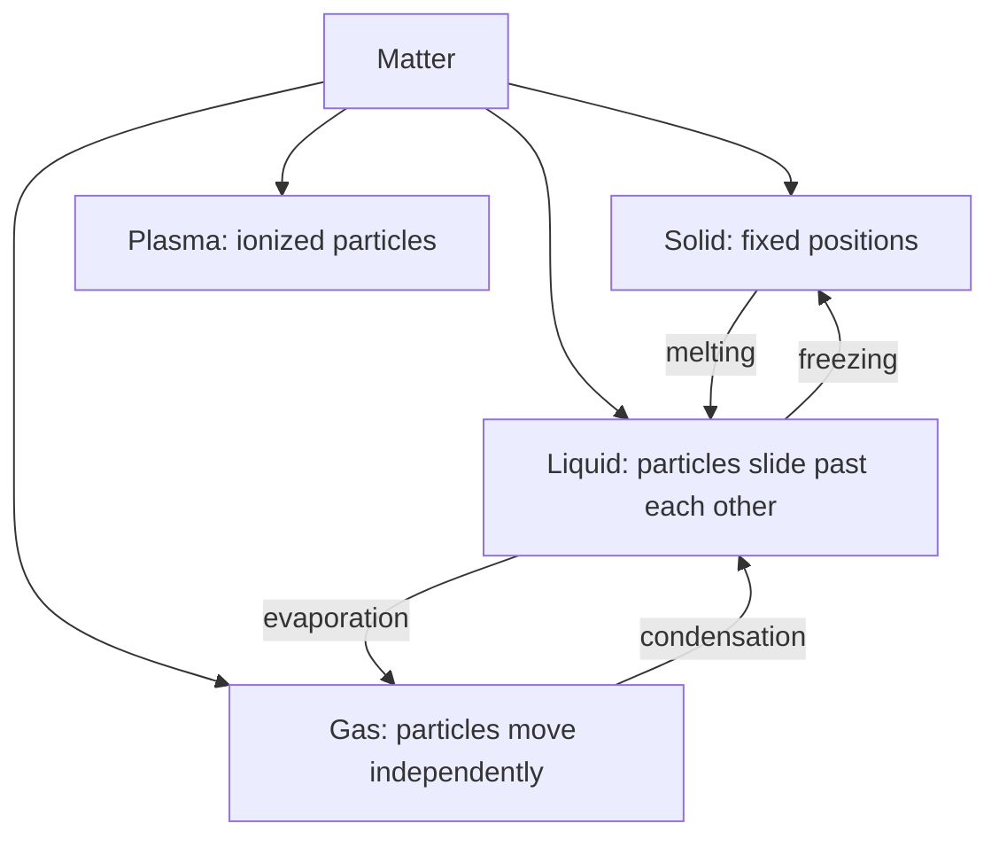
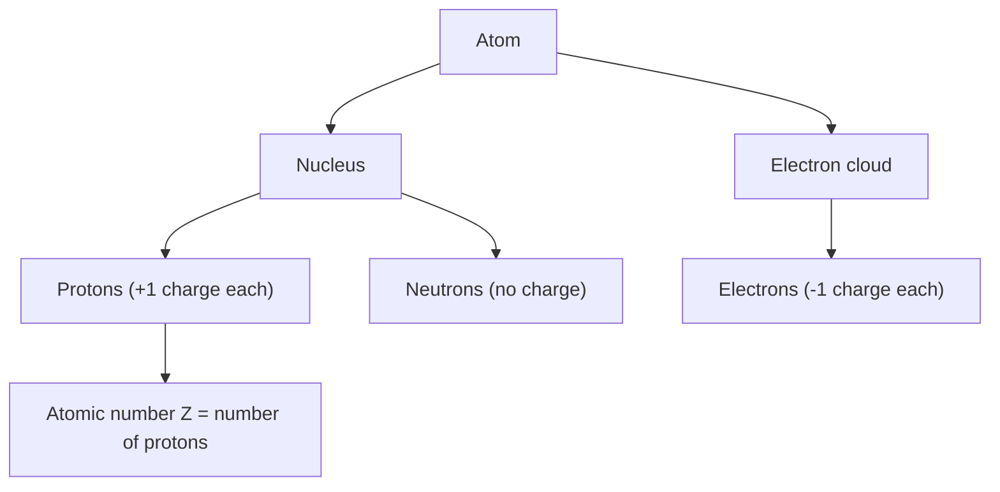
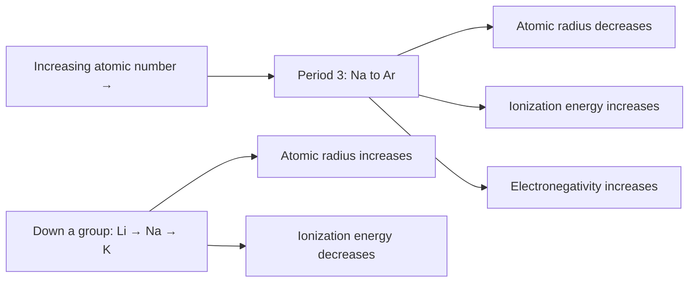
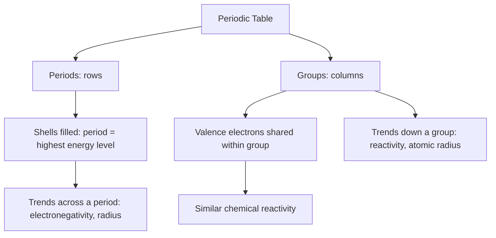
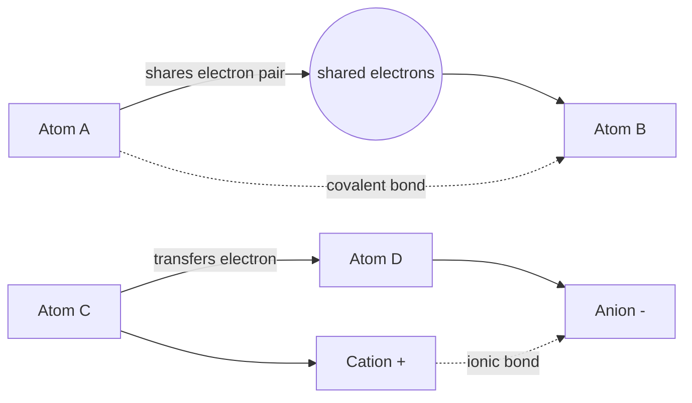
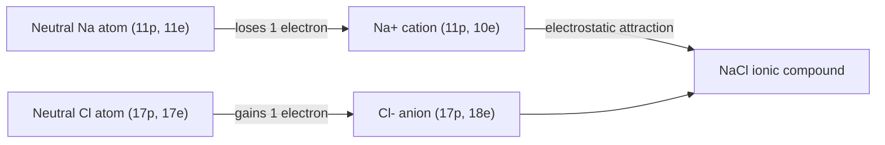

# SPL Run: build_concept_book

- **Adapter:** claude_cli
- **Model:** claude-sonnet-5
- **Tokens:** 22308 in / 12976 out
- **Latency:** 378372ms
- **Timestamp:** 2026-09-27 16:26:09

## Output

```output


---

## Element

An **element** is a pure substance made of only one type of atom — meaning every atom has the same number of protons (its atomic number). Because chemical reactions only rearrange bonds between atoms without altering what's inside the nucleus, elements cannot be broken down into anything simpler by chemical means. This distinguishes them from **compounds** (like water, $H_2O$), which contain two or more elements chemically bonded and *can* be decomposed into their constituent elements. There are 118 known elements, organized by atomic number on the periodic table, with 94 occurring naturally on Earth.

**Worked example**: Consider a sample of pure copper wire and a sample of table salt (sodium chloride, NaCl). Copper is an element — every atom in the wire has 29 protons, and no chemical process (burning, dissolving, reacting with acid) will turn copper into something else, because that would require changing the nucleus itself. Salt, by contrast, is a compound: it can be decomposed by electrolysis into sodium metal (Na) and chlorine gas ($Cl_2$), each of which is a distinct element with its own atomic number (11 and 17, respectively). Sodium and chlorine themselves cannot be broken down further by chemical means — only elements share this property.

**Problem-solving application**: When analyzing an unknown substance, the first diagnostic question is whether it can be chemically decomposed. If heating, electrolysis, or reaction with another substance splits it into two or more different products with new properties, it's a compound or mixture, not an element. For example, if a student heats a silvery solid and it releases a gas while turning into a different-colored residue, that's evidence of decomposition — ruling out "element" as the classification, since an element under those same conditions might melt, boil, or react, but the atoms themselves remain chemically identical throughout, just rearranged or combined with others. This decomposition test is the practical criterion chemists use to sort matter: pure substances that resist decomposition are elements; those that don't are compounds.

---

## Matter

Matter is anything that has mass and occupies space. Every object you can touch, weigh, or contain in a jar — air, water, rock, your own body — qualifies as matter. According to atomic theory, all matter is composed of atoms: discrete particles of roughly $10^{-10}$ m in diameter that combine to form molecules and, ultimately, every observable substance. Matter exists in distinct physical states — solid, liquid, gas, and plasma — depending on how tightly its particles are bound and how much energy they carry. In a solid, atoms vibrate in fixed positions; in a liquid, they move past one another while staying in contact; in a gas, they move independently and spread to fill available space.

A useful way to apply this concept is through the idea of conservation of mass: in any physical or chemical process, matter is neither created nor destroyed, only rearranged. Consider dissolving 5 g of salt in 100 g of water. The resulting saltwater solution has a mass of exactly 105 g — the salt hasn't vanished, it has dispersed at the atomic level among the water molecules. This principle lets chemists predict the outcomes of reactions: if 12 g of carbon reacts completely with oxygen to form carbon dioxide, the mass of $\text{CO}_2$ produced must equal the combined mass of carbon and oxygen consumed, since no atoms are lost.

This idea becomes a practical problem-solving tool in chemistry. Suppose 10 g of ice melts into liquid water and then evaporates into vapor. Although the substance changes state — appearance, volume, and density all shift dramatically — the mass remains 10 g throughout, because no atoms have been added or removed, only their arrangement and spacing have changed. Recognizing this distinction between a change in state (physical change, same substance) and a change in composition (chemical change, new substances formed) is essential for correctly tracking matter through any process, from a melting ice cube to a rusting nail.


*The four common states of matter and the transitions between them, driven by changes in particle energy and arrangement.*

---

## Dalton's Atomic Theory

In the early 1800s, English chemist John Dalton examined data from countless chemical reactions and noticed a puzzling regularity: elements always combined in fixed, predictable proportions by mass. To explain this, he proposed that matter is built from atoms — particles so small they cannot be divided, created, or destroyed by ordinary chemical means. Dalton's atomic theory rests on four postulates: (1) all matter consists of indivisible atoms; (2) every atom of a given element is identical in mass and properties, while atoms of different elements differ; (3) compounds form when atoms combine in small, fixed whole-number ratios; and (4) chemical reactions rearrange atoms but never create, destroy, or convert them into atoms of another element.

Consider water and hydrogen peroxide, both made only of hydrogen and oxygen. Water is $\text{H}_2\text{O}$ — a 2:1 ratio of hydrogen to oxygen atoms — while hydrogen peroxide is $\text{H}_2\text{O}_2$, a 1:1 ratio. Dalton's theory explains why these are distinct substances with sharply different properties: the *same two elements* combine in *different fixed whole-number ratios* to produce different compounds. This was one of Dalton's key pieces of evidence for his theory — when he compared the mass of oxygen that combines with a fixed mass of hydrogen across different compounds, the ratios always reduced to small whole numbers, exactly as his atomic model predicted.

Dalton's postulates also give chemists a practical problem-solving tool. In a reaction such as $2\text{H}_2 + \text{O}_2 \rightarrow 2\text{H}_2\text{O}$, the number of hydrogen and oxygen atoms on each side must match, because atoms are neither created nor destroyed — they only rearrange. This is exactly why chemical equations must be balanced: it is a direct, practical consequence of Dalton's fourth postulate. When students balance equations or use stoichiometry to predict how much product a reaction yields, they are applying this same idea, even a century after some of Dalton's details were revised.

Modern physics has shown that atoms are not truly indivisible — they contain smaller particles, and atoms of the same element can even differ slightly in mass. Yet for ordinary chemical reactions, Dalton's core insight holds: atoms rearrange, they don't vanish or transmute, and this idea remains the foundation of quantitative chemistry.

---

## Atom

An **atom** is the smallest unit of an element that retains the chemical identity of that element and can participate in a chemical reaction. This definition comes from John Dalton's atomic theory (1803), which proposed that all matter is composed of indivisible atoms, that atoms of a given element share the same mass and properties, and that chemical reactions rearrange atoms rather than create or destroy them. Modern physics later showed that atoms are themselves built from smaller pieces — protons and neutrons packed into a dense central nucleus, surrounded by electrons — but the atom is still the smallest particle that behaves as a discrete unit of an element in ordinary chemistry.

What fixes an atom's identity as one element rather than another is its number of protons, called the **atomic number** ($Z$). Every atom with $Z=6$ is carbon; every atom with $Z=11$ is sodium — no matter how many neutrons or electrons it happens to have. Protons and neutrons contribute almost all of an atom's mass, while electrons, far lighter and held around the nucleus by electrostatic attraction, contribute almost none.

**Worked example:** A neutral atom of sodium (Na) has $Z=11$, so it contains 11 protons and, when neutral, 11 electrons to balance that positive charge. Its mass number is 23, so the remaining mass comes from $23 - 11 = 12$ neutrons. Knowing $Z$ alone is enough to identify the element; the neutron count affects mass but not identity.

**Problem-solving application:** Atomic number lets you identify an unknown element from experimental particle counts. Suppose a detector reports that an atom contains 17 protons — you can look up $Z=17$ on the periodic table and identify it as chlorine, regardless of how many neutrons or electrons were also measured. This is the basic logic behind mass spectrometry and nuclear chemistry: proton count is the fingerprint of an element, while neutron and electron counts describe variations (in mass or charge) within that same identity. Later sections build on this atomic structure to explain how electrons determine bonding behavior.

---

## Electric Charge

Electric charge is a fundamental property of matter that comes in two types, conventionally labeled positive and negative. Protons carry positive charge, electrons carry negative charge, and neutrons carry none. Charge determines how particles interact electromagnetically: like charges repel, opposite charges attract. Charge is quantized — it exists only in whole-number multiples of the elementary charge, $e = 1.602 \times 10^{-19}$ coulombs — and it is conserved in every physical process, meaning the total charge of an isolated system never changes, even during chemical reactions, nuclear decay, or particle collisions.

An atom is electrically neutral when its number of protons equals its number of electrons. Ions form when atoms gain or lose electrons: a sodium atom (Na) loses one electron to become Na⁺, while a chlorine atom (Cl) gains one electron to become Cl⁻. This transfer of charge is what drives ionic bonding — the attraction between Na⁺ and Cl⁻ is a direct electromagnetic consequence of their opposite charges, and it explains why table salt (NaCl) holds together as a rigid crystal lattice. Because charge is conserved, the electron sodium loses is exactly the electron chlorine gains — nothing is created or destroyed, only transferred from one atom to the other.

To apply this concept in problem-solving: when analyzing a chemical reaction, always check that total charge balances on both sides of the equation, just as mass must balance — the sum of charges among reactants must equal the sum among products. When predicting whether a particular ion will form and remain stable, ask which arrangement of gained or lost electrons gives the atom a full outer electron shell, since that configuration minimizes the system's overall energy; sodium loses exactly one electron (not two) and chlorine gains exactly one electron (not two) because those specific transfers reach a stable, low-energy configuration. Electric charge — and the ions it produces — is the reason atoms bond into compounds, salts dissolve and conduct electricity in solution, and biological membranes maintain the voltage gradients that let neurons fire.

---

## Neutron

The neutron is an electrically neutral particle residing in the atomic nucleus alongside protons. Its mass, $1.675 \times 10^{-27}\text{ kg}$ (about $1.0087$ atomic mass units), is slightly greater than that of the proton, and its existence explains a puzzle that troubled early 20th-century physicists: why do atoms of the same element sometimes have different masses? Ernest Rutherford had proposed in 1920 that the nucleus might contain a neutral particle to account for the "missing" mass beyond what protons alone could supply, but no one could detect it directly, since detectors of the era relied on charge to register particles. James Chadwick resolved this in 1932 by bombarding beryllium with alpha particles and observing a radiation that could knock protons out of paraffin wax yet left no trace in a charge-sensitive detector. He correctly interpreted this as a neutral particle with roughly the mass of a proton — the neutron — earning him the 1935 Nobel Prize in Physics.

**Worked example.** Consider carbon: every carbon atom has 6 protons (defining it as carbon), but the number of neutrons can vary. Carbon-12 has 6 neutrons ($6p + 6n = 12$ mass units), while carbon-14 has 8 neutrons ($6p + 8n = 14$). These are isotopes — same element, different neutron count, different mass and different nuclear stability. Carbon-14 is unstable and undergoes radioactive decay at a known rate, which is exactly why it is used in radiocarbon dating.

**Problem-solving application.** Given an isotope notation like $^{23}_{11}\text{Na}$, you can find the neutron count directly: mass number ($A = 23$) minus atomic number ($Z = 11$) gives $N = A - Z = 12$ neutrons. This simple subtraction is a standard tool for identifying isotopes, predicting nuclear stability (nuclei with neutron-to-proton ratios far from typical values tend to be radioactive), and balancing nuclear equations in fission and fusion reactions, where the total number of protons and neutrons must be conserved on both sides.

Because neutrons carry no charge, they are not repelled by the positively charged nucleus, making them effective projectiles for inducing nuclear reactions — a property later exploited in nuclear fission reactors and weapons research.

---

## Proton

A proton is a positively charged subatomic particle found in the nucleus of every atom, carrying a charge of $+1$ elementary charge ($+1.602 \times 10^{-19}$ C) and a mass of approximately 1 atomic mass unit (amu), or about $1.673 \times 10^{-27}$ kg. Protons were identified by Ernest Rutherford through his gold foil experiments (1911), which revealed that atoms contain a small, dense, positively charged nucleus rather than the diffuse "plum pudding" structure previously proposed by J.J. Thomson. The number of protons in an atom's nucleus — the atomic number, $Z$ — determines the identity of the element and dictates its position on the periodic table.

**Worked example:** Consider a neutral carbon atom, atomic number 6. It contains 6 protons in its nucleus. Because the atom is electrically neutral, it must also contain 6 electrons to balance the positive charge. If this atom loses two electrons to become a $\text{C}^{2+}$ ion, the proton count remains unchanged at 6 — only the electron count changes, to 4. This distinction is central to problem-solving in chemistry: protons define the element and never change during ordinary chemical reactions or ionization; only electron count (and sometimes neutron count, in nuclear processes) varies.

**Problem-solving application:** Given an ion's mass number, atomic number, and net charge, you can determine the exact particle composition. For example, an ion with atomic number 17 (chlorine), mass number 35, and a charge of $-1$: protons $= Z = 17$; neutrons $= A - Z = 35 - 17 = 18$; electrons $=$ protons $+ |{\text{charge}}| = 17 + 1 = 18$ (extra electron gives the negative charge). This kind of accounting — using atomic number to fix protons, then adjusting only electrons for charge and only neutrons for mass number — is the standard method for solving isotope and ion composition problems in introductory chemistry.


*The proton's location within the nucleus and its role in defining atomic number.*

---

## Nucleus

Every atom has a nucleus: a tiny, dense core made of protons and neutrons, collectively called nucleons. Although the nucleus accounts for less than 1/10,000th of an atom's diameter, it holds more than 99.9% of the atom's mass, because protons and neutrons are roughly 1,800 times heavier than electrons. Protons carry a positive electric charge, neutrons carry none, and the number of protons — the atomic number — defines which element the atom is. The mass number is the total count of protons plus neutrons in a given nucleus. The nucleus's positive charge attracts the negatively charged electrons that occupy the much larger surrounding space, holding the atom together through electrostatic attraction.

**Worked example.** Consider a carbon atom with atomic number 6 and mass number 12. The atomic number tells you the nucleus contains 6 protons — that's what makes it carbon rather than any other element. The mass number, 12, is protons plus neutrons combined, so the neutron count is 12 − 6 = 6. Now consider oxygen, atomic number 8, mass number 16: 8 protons (fixed by the atomic number) and 16 − 8 = 8 neutrons. In both cases, the proton count alone determines elemental identity, while the neutron count is found only by subtracting the atomic number from the mass number.

**Problem-solving application.** This subtraction — neutrons = mass number − atomic number — is the single calculation you'll use repeatedly in chemistry: to check the composition of any nucleus, to balance nuclear equations, and to track how proton and neutron counts change during radioactive decay or fission. It also explains a key organizing principle of chemistry: nuclear charge, not mass, determines chemical identity and behavior. Two atoms of the same element always have the same number of protons (and, in a neutral atom, the same number of electrons), so their chemical reactivity is identical, even if their masses differ. Protons and electrons govern how an atom bonds and reacts; neutrons mainly add mass and influence the nucleus's stability. Keeping proton count and mass number straight — and knowing that subtracting one from the other gives you neutrons — is the foundation you'll build on for every later topic involving nuclear structure, from radioactive decay to nuclear binding energy to the layout of the periodic table itself.

---

## Atomic Number

The **atomic number** (symbol \(Z\)) of an atom is the count of protons in its nucleus. This single number is the identity card of an element: every atom with \(Z = 6\) is carbon, every atom with \(Z = 79\) is gold, and no exceptions exist. Changing the number of protons literally transforms one element into another (as happens in nuclear reactions), whereas changing the number of neutrons or electrons does not — those changes produce isotopes or ions of the same element. Atomic number should not be confused with mass number (\(A\)), which is the sum of protons and neutrons; \(Z\) alone fixes elemental identity, while \(A\) varies among isotopes of that element.

In a neutral atom, the number of electrons equals the atomic number, since the negative electron charge must balance the positive charge of the protons. This is why \(Z\) also determines an element's chemical behavior: electron configuration — and therefore reactivity, bonding patterns, and position in the periodic table — is a direct consequence of proton count. The periodic table itself is ordered by increasing atomic number, not atomic mass, which is why elements like tellurium (\(Z=52\)) and iodine (\(Z=53\)) sit correctly by chemical property despite tellurium having a higher average atomic mass.

**Worked example:** An atom has 17 protons, 18 neutrons, and 17 electrons. What is its atomic number, and what element is it? The atomic number equals the proton count, so \(Z = 17\). Consulting the periodic table, \(Z = 17\) corresponds to chlorine (Cl). The mass number is \(A = 17 + 18 = 35\), making this the isotope chlorine-35. If this atom instead gained an extra electron (18 electrons, 17 protons), it would become a chloride ion, \(\text{Cl}^-\) — still chlorine, since \(Z\) is unchanged.

**Problem-solving application:** Atomic number lets you predict identity and charge from raw particle counts, a routine task in stoichiometry and nuclear chemistry. Given a species with 26 protons, 30 neutrons, and 23 electrons, you can determine: (1) element = iron (\(Z=26\)); (2) mass number = 56; (3) net charge = protons − electrons = \(26 - 23 = +3\), so this is \(\text{Fe}^{3+}\). This three-step logic — proton count fixes element, proton+neutron count fixes isotope, proton−electron count fixes charge — underlies nearly every ion and isotope problem in introductory chemistry.

---

## Periodic Law

The periodic law states that when elements are arranged in order of increasing atomic number, their chemical and physical properties recur at regular intervals. This periodicity is not a coincidence — it reflects the repeating pattern in which electrons fill successive energy shells and subshells. Elements in the same column (group) of the periodic table have the same number of valence electrons, which is why they show similar bonding behavior, reactivity, and typical ion charges. Elements in the same row (period) show a smooth gradation in properties as electrons are added to the same outer shell, until that shell is full and a new period begins.

Consider atomic radius as a worked example. Moving left to right across period 3 (Na, Mg, Al, Si, P, S, Cl, Ar), atomic radius steadily shrinks — from about 186 pm for sodium down to about 71 pm for chlorine — even though each atom has more electrons. The reason is that each added electron enters the same outer shell while the nuclear charge (number of protons) also increases, pulling all outer electrons in more tightly. Moving down a group, such as from lithium to sodium to potassium, radius increases instead, because each step adds a whole new occupied shell farther from the nucleus. The same periodic logic explains ionization energy (a zigzag increase across a period, decrease down a group) and electronegativity (increases across a period, decreases down a group).

This regularity makes the periodic table a genuine predictive tool, not just a filing system. Given only an element's position, you can estimate unmeasured properties. For instance, before germanium was discovered, Mendeleev used the periodic law to predict the density, atomic mass, and reactivity of "eka-silicon," and his predictions matched germanium closely once it was isolated. In practice, the periodic law lets a chemist reason about an unfamiliar element — say, predicting that francium (below cesium) should be an extremely reactive, low-melting metal, or that astatine (below iodine) should behave as a reactive nonmetal — purely from its position, without needing to run the experiment first.


*How atomic radius, ionization energy, and electronegativity trend across a period versus down a group, illustrating the periodicity underlying the periodic law.*

---

## Electron

An electron is a subatomic particle carrying a single negative elementary charge ($-1.602 \times 10^{-19}$ C) and a mass of about $9.11 \times 10^{-31}$ kg — roughly 1/1836 the mass of a proton. Electrons occupy the space surrounding the atomic nucleus, at characteristic distances and energies rather than moving on fixed paths. Because they carry charge and mass at once, electrons determine both an atom's chemical behavior (through bonding and reactivity) and its electrical properties (through conduction).

The electron's existence was established experimentally rather than predicted theoretically. In 1897, J. J. Thomson passed a high-voltage current through an evacuated glass tube, producing a glowing beam — a cathode ray. He found that the beam bent toward a positively charged plate and away from a negatively charged one, proving it was made of negatively charged particles rather than light or neutral matter. By measuring how much the beam deflected under known electric and magnetic fields, Thomson calculated the ratio of the particles' charge to their mass and found it was over a thousand times larger than that of the lightest known ion (hydrogen). This meant the particles were either highly charged or extremely light — and since the ratio stayed the same no matter what gas filled the tube or what metal made up the electrodes, Thomson concluded he had found a universal particle, a fundamental constituent of all atoms. This overturned the idea of the atom as an indivisible sphere and led Thomson to propose a model with electrons embedded in a diffuse positive charge.

For problem-solving, electrons matter most in balancing charge. An atom is electrically neutral because its number of electrons equals its number of protons. When an atom loses or gains electrons, that balance is broken, and the resulting charge equals the difference between protons and electrons. For example, a sodium atom (11 protons, 11 electrons) that loses one electron ends up with 11 protons and only 10 electrons, giving it a net charge of $+1$. This single relationship — count the protons, count the electrons, subtract — is the calculation you will use repeatedly whenever a problem asks you to determine the charge of a particle that has gained or lost electrons.

---

## Periodic Table

The periodic table arranges all known elements in order of increasing atomic number, organized into horizontal rows called **periods** and vertical columns called **groups** (or families). Its power lies in a simple observation: chemical behavior repeats periodically as atomic number increases, because elements in the same group share the same number of valence electrons — the outermost electrons involved in bonding. Elements in Group 1 (alkali metals), for example, each have one valence electron and react vigorously with water; Group 18 (noble gases) have full outer shells and are chemically inert. Periods reflect the filling of successive electron shells: period number equals the highest principal energy level occupied by valence electrons.

**Worked example.** Consider chlorine (Cl, atomic number 17) and fluorine (F, atomic number 9). Both sit in Group 17 (halogens). Fluorine's electron configuration is $1s^2 2s^2 2p^5$; chlorine's is $1s^2 2s^2 2p^6 3s^2 3p^5$. Each has seven valence electrons and needs one more to complete an octet, so both readily gain an electron to form a $-1$ ion and both react with alkali metals to form ionic salts (NaF, NaCl). Their shared valence structure — not their differing atomic mass or shell count — explains their nearly identical reactivity patterns.

**Problem-solving application.** The periodic table lets you predict properties without memorizing them element by element. Suppose you need to predict whether an unknown element X, located directly below potassium (K) in Group 1, will be more or less reactive than potassium. Since reactivity in Group 1 increases going down the group (larger atomic radius means the valence electron is farther from the nucleus and more easily lost), X should be more reactive than potassium. This same logic — locate the group, apply the known trend — lets you estimate atomic radius, ionization energy, and electronegativity trends across periods and down groups, which is the core problem-solving skill the table is designed to support.


*The organizing logic of the periodic table: periods track electron shell filling, groups track shared valence electron count, and both give rise to predictable trends.*

---

## Chemical Bond

A chemical bond is the attractive force that holds two or more atoms together, arising when electrons rearrange to lower the overall potential energy of the system. Atoms bond because isolated atoms (except noble gases) are energetically unstable — their outer, or valence, electron shells are incomplete. By sharing or transferring electrons, atoms can each achieve a filled outer shell, typically eight electrons (the octet rule), producing a more stable, lower-energy arrangement than the separate atoms had on their own.

There are two principal bond types, distinguished by how the electrons are handled. In a **covalent bond**, atoms share one or more pairs of electrons; this occurs between atoms with similar electronegativity (their pull on electrons is comparable), so neither atom fully "wins" the electrons. Covalent bonds dominate in molecules like water ($H_2O$), methane ($CH_4$), and glucose. In an **ionic bond**, one atom's electronegativity is much greater than the other's, so an electron transfers completely from the low-electronegativity atom to the high-electronegativity one. This creates two oppositely charged ions — a positively charged cation and a negatively charged anion — which then attract each other electrostatically, as in sodium chloride ($NaCl$).

**Worked example:** Consider table salt, $NaCl$. Sodium has one loosely held valence electron; chlorine needs just one more electron to complete its outer shell. Sodium transfers its electron to chlorine, producing $Na^+$ and $Cl^-$. These ions then pack into a crystal lattice held together by ionic attraction — explaining why salt is a hard, brittle solid with a high melting point (801 °C), unlike molecular covalent compounds such as water.

**Problem-solving application:** To predict bond type, compare electronegativity difference ($\Delta EN$) between two atoms. A large $\Delta EN$ (roughly $>1.7$, as in $Na$–$Cl$) favors ionic bonding; a small $\Delta EN$ favors covalent bonding, which itself ranges from nonpolar (electrons shared equally, e.g., $H_2$) to polar (shared unequally, e.g., $H_2O$). This distinction predicts real physical properties: ionic compounds conduct electricity when dissolved in water and have high melting points, while covalent compounds generally do not conduct and have lower melting points.


*Covalent bonding involves electron sharing between two atoms, while ionic bonding involves electron transfer, producing oppositely charged ions that attract each other.*

---

## Element Families

The periodic table is organized so that elements in the same vertical column, called a group or family, share similar chemical behavior. This pattern exists because elements in a group have the same number of valence electrons — the outermost electrons that participate in bonding — so they tend to form similar types of compounds and react in analogous ways.

Group 1, the **alkali metals** (lithium, sodium, potassium, rubidium, cesium), each have a single valence electron. They lose that electron readily, forming +1 ions, which makes them extremely reactive — dropping sodium into water produces a vigorous reaction releasing hydrogen gas and heat, sometimes igniting. Reactivity increases down the group as the valence electron sits farther from the nucleus and is held less tightly.

Group 2, the **alkaline earth metals** (beryllium, magnesium, calcium, strontium, barium), have two valence electrons and form +2 ions. They are reactive, though less so than the alkali metals, and are essential in biology — calcium in bones and magnesium in chlorophyll.

Group 17, the **halogens** (fluorine, chlorine, bromine, iodine), have seven valence electrons, just one short of a full outer shell. They readily gain an electron to form −1 ions, making them highly reactive nonmetals. This is why halogens combine so easily with alkali metals: sodium (+1) and chlorine (−1) form the stable ionic compound NaCl, table salt.

Group 18, the **noble gases** (helium, neon, argon, krypton, xenon), have a complete outer electron shell. With no tendency to gain, lose, or share electrons, they are chemically inert under most conditions — which is why neon and argon are used in lighting and welding, where unreactive gases are needed.

**Worked example**: Predict the compound formed between potassium (group 1) and bromine (group 17). Potassium loses one electron (K⁺), bromine gains one electron (Br⁻), and the oppositely charged ions combine in a 1:1 ratio to form KBr — following the same pattern as NaCl.

**Problem-solving application**: Given an unknown element's group number, you can predict its likely ion charge, reactivity trend, and probable bonding partners without memorizing individual element properties — group position alone provides strong predictive power.

---

## Ion

An ion is an atom or molecule that carries a net electric charge because its number of electrons no longer equals its number of protons. A neutral atom has equal protons and electrons, so the positive and negative charges cancel out. When an atom gains one or more electrons, it accumulates extra negative charge and becomes an **anion**. When an atom loses one or more electrons, it has a surplus of protons and becomes a **cation**. The number of protons—and therefore the identity of the element—never changes during ionization; only the electron count shifts.

**Worked example:** Consider a neutral sodium atom (Na), which has 11 protons and 11 electrons. Sodium readily loses its single outermost electron to achieve a stable, filled electron shell. The resulting particle still has 11 protons but only 10 electrons, giving it a net charge of +1. We write this as $\text{Na}^{+}$. Chlorine (Cl), with 17 protons and 17 electrons, tends to do the opposite: it gains one electron to fill its outer shell, producing 17 protons and 18 electrons, a net charge of $-1$, written $\text{Cl}^{-}$. When $\text{Na}^{+}$ and $\text{Cl}^{-}$ come together, their opposite charges attract, forming the ionic compound sodium chloride (table salt), $\text{NaCl}$.

**Problem-solving application:** Ion charge can be predicted and calculated directly from electron transfer. If an atom with atomic number $Z$ loses $n$ electrons, its charge is $+n$; if it gains $n$ electrons, its charge is $-n$. For example, magnesium ($Z = 12$) commonly loses 2 electrons to form $\text{Mg}^{2+}$, while oxygen ($Z = 8$) gains 2 electrons to form $\text{O}^{2-}$. This predictable behavior lets you determine the formula of an ionic compound: charges must balance to zero overall, so one $\text{Mg}^{2+}$ pairs with one $\text{O}^{2-}$ to form $\text{MgO}$, whereas two $\text{Na}^{+}$ ions are needed to balance one $\text{O}^{2-}$, giving $\text{Na}_2\text{O}$. This charge-balancing rule is the basis for writing correct chemical formulas for any ionic compound and for predicting solubility and reactivity patterns in solution chemistry.


*Electron transfer between sodium and chlorine atoms produces oppositely charged ions that combine to form an ionic compound.*

---

## Predicting Ion Formation

Atoms form ions to reach the stable electron configuration of the nearest noble gas — a full outer shell of eight electrons (or two, for elements near helium). An element's group number on the periodic table tells you how many valence electrons it has, and that number predicts whether the atom will lose or gain electrons, and how many, to become an ion.

Metals, found on the left side of the table, have few valence electrons and low ionization energy — it takes little energy to remove them. Group 1 metals (like sodium) lose 1 electron to form a +1 cation; Group 2 metals (like magnesium) lose 2 electrons to form a +2 cation; Group 13 metals (like aluminum) lose 3 electrons to form a +3 cation. In each case, losing electrons empties the outer shell, exposing the full shell beneath it — matching the configuration of the noble gas that precedes the metal in the previous row.

Nonmetals, on the right side of the table, have high electron affinity — they attract additional electrons strongly. Group 17 nonmetals (halogens, like chlorine) gain 1 electron to form a −1 anion; Group 16 nonmetals (like oxygen) gain 2 electrons to form a −2 anion; Group 15 nonmetals (like nitrogen) gain 3 electrons to form a −3 anion. Gaining electrons fills the outer shell to match the noble gas that follows the nonmetal in the same row.

**Worked example**: Predict the ion formed by sulfur (S, Group 16) and by calcium (Ca, Group 2). Sulfur has 6 valence electrons; gaining 2 gives it 8, matching argon's configuration, so sulfur forms S²⁻. Calcium has 2 valence electrons; losing both empties its outer shell, matching argon's configuration from below, so calcium forms Ca²⁺.

**Problem-solving application**: When predicting the formula of an ionic compound, match total positive and negative charge. Combining Ca²⁺ with Cl⁻ (Group 17, forms −1) requires two chloride ions to balance one calcium ion, giving CaCl₂. This charge-balancing logic — derived directly from group number — lets you predict formulas for hundreds of ionic compounds without memorizing each one individually.

---

## Payoff

Predicting ion formation is where the periodic table stops being a chart to memorize and becomes a tool you can calculate with. Every atom "wants" a stable outer electron shell — usually eight electrons, the octet — and it will gain, lose, or share electrons to get there. Metals on the left side of the table have only one, two, or three valence electrons; it is energetically cheaper for them to lose those electrons than to gain seven more, so they form cations (Na loses one electron to become $\text{Na}^+$, Mg loses two to become $\text{Mg}^{2+}$). Nonmetals on the right side are close to a full octet already, so they gain electrons instead, forming anions ($\text{Cl}$ gains one electron to become $\text{Cl}^-$, $\text{O}$ gains two to become $\text{O}^{2-}$). The number of electrons gained or lost is not arbitrary — it is set by an element's group number, which tells you its valence electron count and therefore its most stable ionic charge.

This is why the concept sits at the end of the book rather than in the middle: it is the payoff of everything that came before it — atomic structure, the organization of the periodic table, and electron configuration all converge here into a single predictive skill. Once you can predict that calcium forms $\text{Ca}^{2+}$ and fluorine forms $\text{F}^-$, you can predict the formula of the compound they form ($\text{CaF}_2$) by balancing charges, which is the foundation of writing and naming ionic compounds. That same charge-balancing logic scales directly into stoichiometry, where you need correct formulas to compute molar masses and reacting quantities, and into solution chemistry, where the identity and charge of dissolved ions determine conductivity, precipitation reactions, and net ionic equations. In biology and earth science, this same skill explains why $\text{Na}^+$ and $\text{K}^+$ drive nerve signaling and why $\text{Ca}^{2+}$ and $\text{CO}_3^{2-}$ combine to form limestone.

Pick one of these directions and follow it further: work out the formulas and names for a table of common ionic compounds, or trace how sodium and potassium ions moving across a cell membrane generate the electrical signal of a nerve impulse. Either path shows the same underlying rule doing real explanatory work.
```
